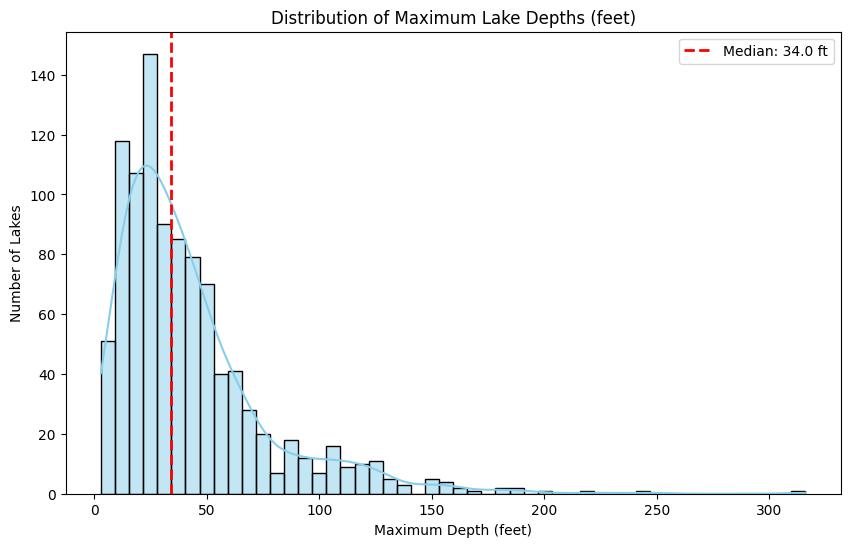
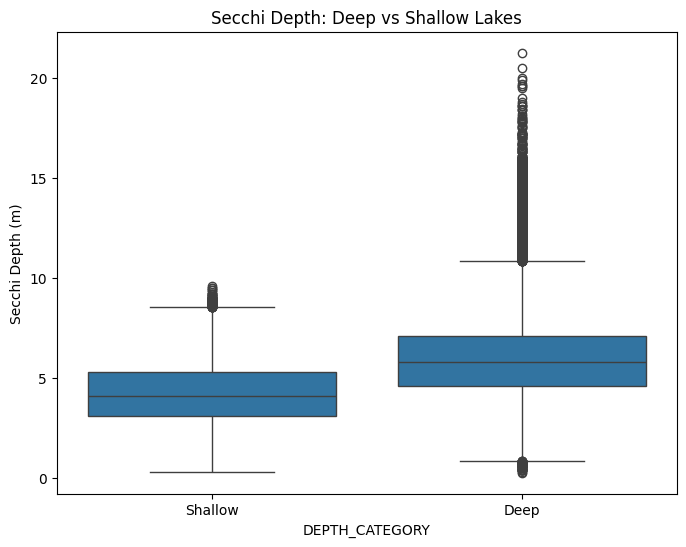

# Experiment: Deep vs Shallow Lakes Comparison

## Depth Distribution and Thresholding

To classify lakes, we analyzed the unique maximum depths of lakes across the dataset. The median maximum depth was calculated to establish an objective dichotomy.

**Threshold Choice**: 34.0 feet. Lakes with maximum depths >= 34.0 feet are classified as 'Deep', and those < 34.0 feet are 'Shallow'.

## Comparative Statistics

We compared key water quality metrics across the two groups (Deep vs Shallow):

| DEPTH_CATEGORY | SECCHI_mean | SECCHI_median | SECCHI_std | SECCHI_count | TMAX_mean | TMAX_median | TMAX_std | TMAX_count | TMIN_mean | TMIN_median | TMIN_std | TMIN_count | TPBG_mean | TPBG_median | TPBG_std | TPBG_count | CHLA_mean | CHLA_median | CHLA_std | CHLA_count |
| --- | --- | --- | --- | --- | --- | --- | --- | --- | --- | --- | --- | --- | --- | --- | --- | --- | --- | --- | --- | --- |
| Deep | 5.98 | 5.8 | 2.14 | 106603 | 20.82 | 21.8 | 4.3 | 30371 | 9.68 | 9.2 | 3.59 | 30371 | 41.09 | 15.0 | 264.39 | 5037 | 5.18 | 3.1 | 6.89 | 19990 |
| Shallow | 4.19 | 4.1 | 1.56 | 47701 | 21.13 | 22.1 | 4.28 | 13720 | 15.24 | 15.3 | 5.17 | 13720 | 40.8 | 18.0 | 103.51 | 1902 | 7.27 | 4.02 | 10.52 | 9386 |

### Key Observations:
- **Secchi Transparency:** Deep lakes generally exhibit greater secchi depth (higher clarity) on average compared to shallow lakes.
- **Temperature & Biology:** Deeper lakes tend to have lower bottom temperatures (TMIN) and may show distinct Chlorophyll-a and Phosphorus (TPBG) distributions.

