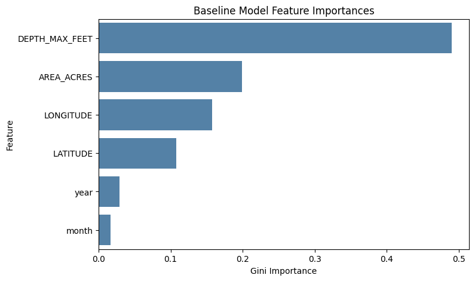

# Experiment 10: Baseline Predictive Model for Secchi Depth

## Objective

Create the first chronological predictive baseline for Secchi depth using only the low-missingness geographic and temporal feature set.

## Method

Filter to rows with non-missing target, sampling date, and baseline predictors. Sort by `SAMPDATE`, split the timeline 80/20, train a RandomForestRegressor on the earlier segment, and evaluate on the held-out future segment.

## Parameters

Model: `RandomForestRegressor`.

- `n_estimators=100`
- `max_depth=10`
- `random_state=42`

Feature set:
- `year`
- `month`
- `LATITUDE`
- `LONGITUDE`
- `AREA_ACRES`
- `DEPTH_MAX_FEET`

Train rows: 123,443 (1952-08-01 to 2015-07-06)

Test rows: 30,861 (2015-07-06 to 2022-11-28)

## Results

### Performance Metrics

- MAE: 0.926 m
- MSE: 1.519 m^2
- RMSE: 1.233 m
- R^2: 0.658

### Feature Importances

| Feature | Importance |
| --- | --- |
| DEPTH_MAX_FEET | 0.49 |
| AREA_ACRES | 0.199 |
| LONGITUDE | 0.158 |
| LATITUDE | 0.108 |
| year | 0.029 |
| month | 0.016 |

## Next Step

Use this chronology-aware baseline as the reference point for segmented models, generalization tests, and later chemically enriched feature sets.
