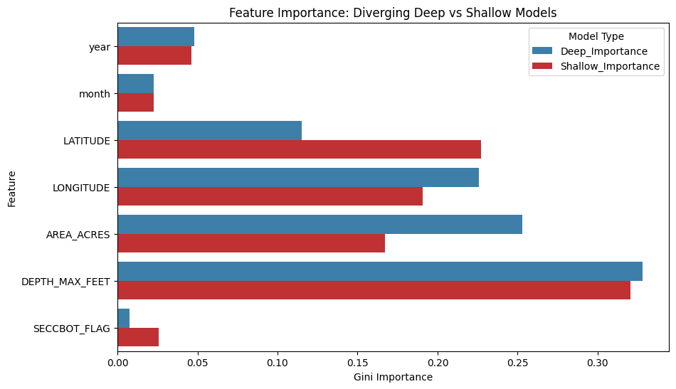

# Experiment: Divergent Deep vs Shallow Regression Models

## Model Design & Features

**Model Architecture:** Two distinct Random Forest Regressors (`n_estimators=100`, `max_depth=10`) were created. Model A was exclusively restricted to Deep lakes (Max Depth >= 34 ft), and Model B was restricted to Shallow lakes (< 34 ft).

**Features Utilized:** Both models accessed an identical feature space:
1. `year`
2. `month`
3. `LATITUDE`
4. `LONGITUDE`
5. `AREA_ACRES`
6. `DEPTH_MAX_FEET`
7. `SECCBOT_FLAG` (Binary flag indicating if Secchi hit bottom)

## Strict Temporal Splitting (No Lookahead Bias)

Both models strictly implemented an 80/20 chronological split within their respective domains to ensure no mathematical leakage from the future to the past.

**Deep Model Data Allocation:**
- Training Set (80%): 85,105 rows (1952-08-01 to 2015-06-06)
- Testing Set (20%): 21,277 rows (2015-06-06 to 2022-11-22)

**Shallow Model Data Allocation:**
- Training Set (80%): 38,063 rows (1970-06-16 to 2015-08-30)
- Testing Set (20%): 9,516 rows (2015-08-30 to 2022-11-28)

## Evaluate Performance Metrics

The performance divergence reveals fascinating physical limitations about modeling these environments collectively:

| Model | MAE | MSE | RMSE | R2 |
| --- | --- | --- | --- | --- |
| Deep (>= 34 ft) | 0.978 | 1.659 | 1.288 | 0.62 |
| Shallow (< 34 ft) | 0.681 | 0.856 | 0.925 | 0.629 |

The Shallow model generates significantly lower absolute error variance, likely because the total potential range of a Secchi reading in a shallow lake is physically truncated by the bottom (enforced by `SECCBOT`). Conversely, the Deep model has far more complex modeling requirements to capture deep-water clarities.

## Comparative Feature Importances

The degree to which the two individual environments relied on different feature inputs:

| Feature | Deep_Importance | Shallow_Importance |
| --- | --- | --- |
| DEPTH_MAX_FEET | 0.328 | 0.321 |
| AREA_ACRES | 0.253 | 0.167 |
| LONGITUDE | 0.226 | 0.191 |
| LATITUDE | 0.115 | 0.227 |
| year | 0.048 | 0.046 |
| month | 0.023 | 0.023 |
| SECCBOT_FLAG | 0.008 | 0.026 |

**Key Observations:** `SECCBOT` drives almost zero importance in the Deep model, but serves as a crucial parameter bounding the Shallow environment boundaries! Additionally, the exact depth matters dramatically more for deep lakes than it does for shallow lakes.
