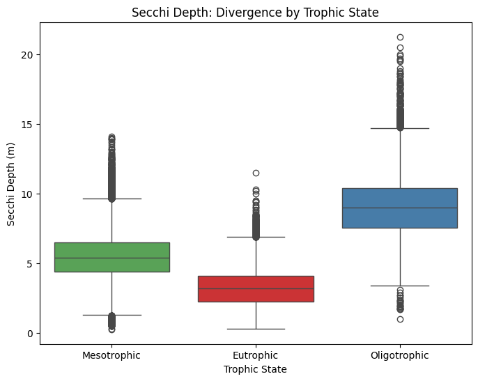
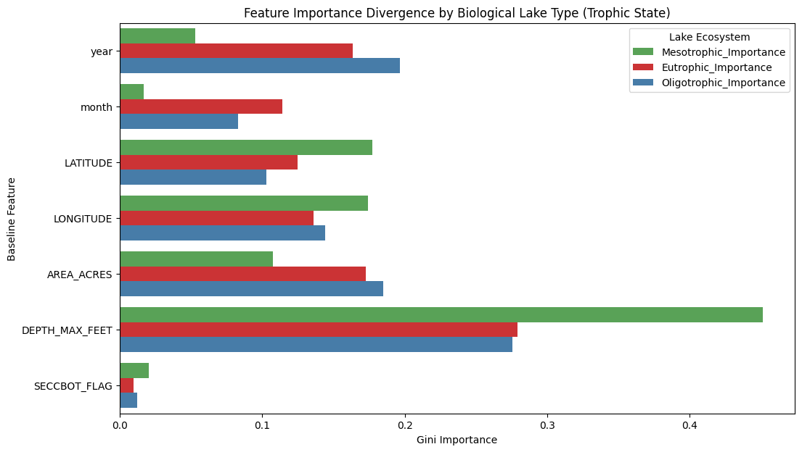

# Experiment: Lake Type Divergent Modeling (Trophic States)

## Model Design & Features

**Model Architecture:** Distinct Random Forest Regressors (`n_estimators=100`, `max_depth=10`) were created for the three primary biological states of lakes defined by `TROPHIC_CATEGORY`: Mesotrophic (Medium nutrient), Eutrophic (High nutrient), and Oligotrophic (Low nutrient).

**Features Utilized:** Identifying how strictly baseline geographics and time impact these unique state models compared to one another:
1. `year`
2. `month`
3. `LATITUDE`
4. `LONGITUDE`
5. `AREA_ACRES`
6. `DEPTH_MAX_FEET`
7. `SECCBOT_FLAG`

## Data Separation Summary

The dataset was separated into distinct lake types based on their biological `TROPHIC_CATEGORY`. The summary statistics of perfectly viable observations (non-missing target and base features) for each type are:

| Lake Type | Total Valid Observations |
| --- | --- |
| Mesotrophic | 113426 |
| Eutrophic | 26891 |
| Oligotrophic | 13584 |

## Comparative Statistics

We compared key water quality metrics across the three biological groups:

| Trophic State | SECCHI_mean | SECCHI_median | SECCHI_std | SECCHI_count | TMAX_mean | TMAX_median | TMAX_std | TMAX_count | TMIN_mean | TMIN_median | TMIN_std | TMIN_count | TPBG_mean | TPBG_median | TPBG_std | TPBG_count | CHLA_mean | CHLA_median | CHLA_std | CHLA_count |
| --- | --- | --- | --- | --- | --- | --- | --- | --- | --- | --- | --- | --- | --- | --- | --- | --- | --- | --- | --- | --- |
| Eutrophic | 3.29 | 3.2 | 1.39 | 26973 | 20.0 | 21.1 | 4.78 | 8551 | 13.26 | 12.7 | 4.76 | 8551 | 90.21 | 26.0 | 434.89 | 1868 | 12.08 | 7.7 | 13.29 | 7474 |
| Mesotrophic | 5.47 | 5.4 | 1.59 | 114826 | 21.26 | 22.2 | 4.1 | 32350 | 11.17 | 10.1 | 4.86 | 32350 | 23.84 | 14.0 | 52.55 | 4722 | 3.86 | 3.0 | 3.84 | 20518 |
| Oligotrophic | 9.09 | 9.0 | 2.22 | 13596 | 19.88 | 20.9 | 4.31 | 3167 | 8.85 | 8.5 | 3.39 | 3167 | 10.49 | 9.0 | 8.78 | 360 | 1.87 | 1.6 | 1.47 | 1569 |

**Key Observations:** Oligotrophic lakes generally exhibit the highest secchi depth (clarity), while Eutrophic lakes are the murkiest (lowest SECCHI). Similar separations exist natively in related ecological parameters such as Chlorophyll-a (CHLA).

## Strict Temporal Split (Chronological Holdout)

Every model exclusively adhered to the absolute chronological 80/20 train/test split within its own subset, protecting the timeline integrity.

**Mesotrophic Data Allocation:**
- Training Set (80%): 90,740 rows (1952-08-01 to 2015-08-29)
- Testing Set (20%): 22,686 rows (2015-08-29 to 2022-11-28)

**Eutrophic Data Allocation:**
- Training Set (80%): 21,512 rows (1970-06-08 to 2014-06-21)
- Testing Set (20%): 5,379 rows (2014-06-22 to 2022-11-07)

**Oligotrophic Data Allocation:**
- Training Set (80%): 10,867 rows (1970-06-17 to 2014-05-22)
- Testing Set (20%): 2,717 rows (2014-05-22 to 2022-10-23)

## Evaluate Performance Metrics

The performance divergence reveals physical modeling limits between ecosystems:

| Model (Trophic State) | MAE | MSE | RMSE | R2 |
| --- | --- | --- | --- | --- |
| Mesotrophic | 0.82 | 1.171 | 1.082 | 0.57 |
| Eutrophic | 0.776 | 1.152 | 1.073 | 0.43 |
| Oligotrophic | 1.248 | 2.821 | 1.68 | 0.483 |

**Key Observation:** Eutrophic lakes (highly productive, murky logic) have significantly lower absolute error boundaries because their secchi disk inherently hits zero rapidly. Contrastly, Oligotrophic lakes represent deep clarity and provide a much larger numeric variance scope making prediction precision harder.

## Comparative Feature Importances

A breakdown of how these distinct ecosystems mathematically utilized geometry to predict clarity. Note how the model dependence on specific geographical traits completely shifts based on the biological classification of the lake.

| Feature | Mesotrophic_Importance | Eutrophic_Importance | Oligotrophic_Importance |
| --- | --- | --- | --- |
| DEPTH_MAX_FEET | 0.451 | 0.279 | 0.276 |
| LATITUDE | 0.177 | 0.125 | 0.103 |
| LONGITUDE | 0.174 | 0.136 | 0.144 |
| AREA_ACRES | 0.107 | 0.172 | 0.185 |
| year | 0.053 | 0.164 | 0.197 |
| SECCBOT_FLAG | 0.02 | 0.01 | 0.012 |
| month | 0.017 | 0.114 | 0.083 |
