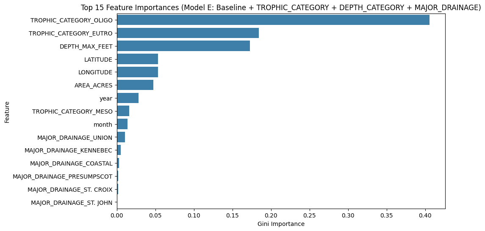

# Experiment 13: Ecological Classes vs Geography

## Data Subset Description

Tested identical datasets across all models to quantify the specific predictive power generated by identifying structural ecological classes compared to exclusively mapping time and geography.

- **Number of valid rows:** 154,304 total rows retained after absolutely strictly filtering down to missing-free data for target (`SECCHI`), time (`SAMPDATE`), and base geographic features.
- **Chronological Array:** The strict 80/20 train/test chronological split was processed identically. Training covers the first 80%, out-of-time testing assesses the final recent 20%.

## Model Performance Comparison (A-E)

| Model | Features added | MAE | RMSE | R2_train | R2_test |
| --- | --- | --- | --- | --- | --- |
| A | Baseline (geo + time) | 0.926 | 1.233 | 0.76 | 0.658 |
| B | + TROPHIC_CATEGORY | 0.932 | 1.242 | 0.77 | 0.653 |
| C | + DEPTH_CATEGORY | 0.926 | 1.233 | 0.76 | 0.658 |
| D | + TROPHIC_CATEGORY + DEPTH_CATEGORY | 0.932 | 1.242 | 0.77 | 0.653 |
| E | + TROPHIC_CATEGORY + DEPTH_CATEGORY + MAJOR_DRAINAGE | 0.952 | 1.271 | 0.759 | 0.636 |

## Incremental Benefit Summary

- Adding `TROPHIC_CATEGORY` identically to the basic geographical representation (Model B) modified the R²_test from 0.658 to 0.6526 (Δ = -0.0054).
- Adding `DEPTH_CATEGORY` individually (Model C, separating strictly deep versus shallow) shifted the test explained variance by a delta of +0.0.
- Combining both ecological classifications without regional context (Model D: `TROPHIC_CATEGORY` + `DEPTH_CATEGORY`) changed the test variance explanation by -0.0054 relative to the baseline.
- Incorporating a reduced set of regional descriptors (Model E: `TROPHIC_CATEGORY`, `DEPTH_CATEGORY`, `MAJOR_DRAINAGE`) shifted the testing accuracy by -0.0217. Tracking the gap between R²_train and R²_test allows measuring whether adding drainage geography yields genuine out-of-time predictive patterns or mostly introduces overfitting to historical trends.

## Feature Importance Comparison (Top 15 in Model E)

| Feature | Importance (Model A) | Importance (Model E) |
| --- | --- | --- |
| TROPHIC_CATEGORY_OLIGO | - | 0.405 |
| TROPHIC_CATEGORY_EUTRO | - | 0.184 |
| DEPTH_MAX_FEET | 0.4899 | 0.173 |
| LATITUDE | 0.1078 | 0.054 |
| LONGITUDE | 0.158 | 0.053 |
| AREA_ACRES | 0.199 | 0.047 |
| year | 0.0292 | 0.028 |
| TROPHIC_CATEGORY_MESO | - | 0.016 |
| month | 0.0162 | 0.014 |
| MAJOR_DRAINAGE_UNION | - | 0.011 |
| MAJOR_DRAINAGE_KENNEBEC | - | 0.005 |
| MAJOR_DRAINAGE_COASTAL | - | 0.003 |
| MAJOR_DRAINAGE_PRESUMPSCOT | - | 0.002 |
| MAJOR_DRAINAGE_ST. CROIX | - | 0.002 |
| MAJOR_DRAINAGE_ST. JOHN | - | 0.001 |

