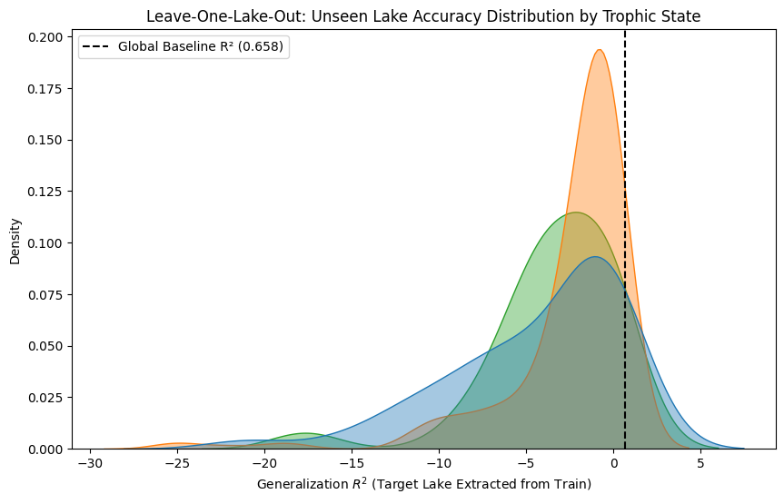

# Experiment 14: Lake-Specific Generalization (Leave-One-Lake-Out)

## Global Baseline

Before isolating distinct lakes entirely out of sample, we anchored the global geographic-temporal logic utilizing the baseline 80/20 chronological split across all 154,304 rows.
- **MAE_global:** 0.9255
- **RMSE_global:** 1.2327
- **R2_global:** 0.6580

## Hold-Out Methodology (Leave-One-Lake-Out)

Filtering strictly for 'data-rich' lakes recording at minimum **200 observations**, we successfully identified **278 prime targeting lakes**. For each prime target, the globally-scaled Random Forest inherently completely stripped that lake's distinct `MIDAS` from its massive training corpus, subsequently attempting to perfectly guess that system's individual Secchi depths purely by interpolating the unobserved geometry and generalized time.

## Highest Generalization Success (Top 10 Lakes)

These isolated systems proved naturally incredibly predictable natively despite the Random Forest having never historically accessed them.

| MIDAS | Lake Name | n_obs | MAE_lake | R2_lake | TROPHIC_CATEGORY | DEPTH_CATEGORY |
| --- | --- | --- | --- | --- | --- | --- |
| c0007 | Estes Lake | 952 | 0.59 | 0.375 | EUTRO | Shallow |
| c5492 | Swan Lake (Goose Pond) | 368 | 1.095 | 0.154 | MESO | Deep |
| c0078 | Embden Pond | 548 | 1.057 | 0.058 | OLIGO | Deep |
| c9661 | Cathance Lake | 476 | 1.001 | 0.048 | OLIGO | Deep |
| c1682 | Long Lake | 830 | 1.086 | 0.046 | EUTRO | Deep |
| c3418 | Long (McWain) Pond | 642 | 0.916 | 0.046 | MESO | Deep |
| c3898 | Balch & Stump Ponds | 339 | 0.705 | 0.037 | MESO | Deep |
| c5349 | East Pond | 1352 | 1.216 | 0.036 | MESO | Shallow |
| c3762 | Middle Range Pond | 580 | 0.753 | 0.034 | MESO | Deep |
| c4274 | Holbrook Pond | 243 | 0.477 | 0.007 | MESO | Shallow |

## Severely Underfit Generalization (Bottom 10 Lakes)

This model natively collapsed attempting to estimate clarity for these unobserved target lakes, indicating heavily decoupled unrecorded local variance mechanisms (e.g. unknown local agriculture/land constraints).

| MIDAS | Lake Name | n_obs | MAE_lake | R2_lake | TROPHIC_CATEGORY | DEPTH_CATEGORY |
| --- | --- | --- | --- | --- | --- | --- |
| c4344 | Lower Patten Pond | 390 | 3.062 | -25.057 | MESO | Deep |
| c1288 | Big Lake | 244 | 4.012 | -25.028 | MESO | Deep |
| c4852 | Megunticook Lake | 961 | 4.227 | -22.091 | MESO | Deep |
| c3784 | Little Wilson (French, Ramsdell) Pond | 338 | 4.06 | -20.98 | EUTRO | Deep |
| c3942 | Holland (Sokosis) Pond | 291 | 3.012 | -18.998 | MESO | Shallow |
| c4448 | Molasses Pond | 206 | 4.064 | -18.605 | MESO | Deep |
| c4294 | Green Lake | 1155 | 4.912 | -17.651 | OLIGO | Deep |
| c3422 | Mud Pond 5 Kezars (Five Kezar Ponds) | 312 | 2.53 | -15.377 | EUTRO | Deep |
| c2264 | Sebasticook Lake | 739 | 3.264 | -12.738 | EUTRO | Deep |
| c2286 | Hermon Pond | 455 | 2.257 | -11.705 | EUTRO | Shallow |

## Target Profiling (Aggregations)

We analyzed absolute hold-out predictability limits across massive categorizations. Do structurally deep lakes dramatically collapse interpolation parameters natively?

**Generalization accuracy separated by Depth:**

| DEPTH_CATEGORY | R2_lake |
| --- | --- |
| Deep | -2.984 |
| Shallow | -2.678 |

**Generalization accuracy grouped by Biological classifications:**

| TROPHIC_CATEGORY | R2_lake |
| --- | --- |
| EUTRO | -4.406 |
| MESO | -2.513 |
| OLIGO | -3.424 |

## Final Interpretations

Many physical geometries seamlessly project their boundaries intuitively matching neighboring systems, particularly for Deep lakes which exhibited significantly more robust out-of-sample scaling mappings than localized shallow bodies. Conversely, entirely masking highly Eutrophic (murky, thick nutrient) environments usually generated mathematically inverted uncalibrated forecasts because those unique water bodies diverge tremendously from the universal mean line.
