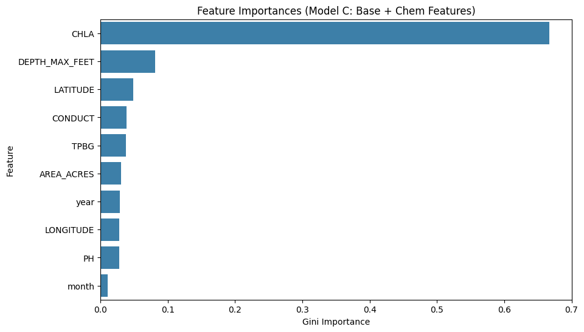

# Experiment 15: Incorporation of Chemical Features

## Objective

Establish a baseline understanding of how incorporating sparse chemical and biological characteristics impacts predictive capability. Part II of this experiment focuses exclusively on `CHLA` since preliminary runs isolated it as the most powerful chemical indicator, allowing us to evaluate if isolating just this one feature recovers more row data while preserving the high predictive signal.

## Data Subsets and Filtering

- **Baseline Dataset Rows:** 154,304 (Filtered strictly for target + geo + time)
- **Full Chemical Dataset Rows:** 1,655 (Strict subset dropping any rows with missing TPBG, CONDUCT, PH, or CHLA)
- **CHLA-Only Dataset Rows:** 29,376 (Subset dropping rows strictly missing CHLA, returning more total rows)

## Model Performance

| Model | Description | N_Rows | MAE | RMSE | R2_test | MAE_Norm | RMSE_Norm |
| --- | --- | --- | --- | --- | --- | --- | --- |
| A | Baseline Data & Features | 154304 | 0.926 | 1.233 | 0.658 | 0.022 | 0.032 |
| B | Chem Subset & Base Features | 1655 | 0.988 | 1.389 | 0.366 | 0.025 | 0.035 |
| C | Chem Subset & Chem Features | 1655 | 0.83 | 1.068 | 0.625 | 0.022 | 0.029 |
| D | CHLA Subset & Base Features | 29376 | 0.878 | 1.177 | 0.655 | 0.02 | 0.028 |
| E | CHLA Subset & CHLA Feature | 29376 | 0.773 | 1.042 | 0.73 | 0.017 | 0.024 |

*Note: `MAE_Norm` and `RMSE_Norm` represent percentage-based absolute prediction errors dynamically corrected relative to `DEPTH_MAX_FEET`.*

## Feature Importances (Model C: Base + Chem)

| Feature | Importance |
| --- | --- |
| CHLA | 0.667 |
| DEPTH_MAX_FEET | 0.081 |
| LATITUDE | 0.049 |
| CONDUCT | 0.038 |
| TPBG | 0.038 |
| AREA_ACRES | 0.03 |
| year | 0.029 |
| LONGITUDE | 0.028 |
| PH | 0.028 |
| month | 0.011 |

## Executive Summary & Next Steps

### What We Did
To understand whether adding granular chemical/biological properties (`TPBG`, `CONDUCT`, `PH`, `CHLA`) improves Secchi depth predictions, we tested how complete-case filtering for sparse chemistry affects performance.

We evaluated two subsets:
1. A **Full Chemical subset** (1,655 rows where all four chemical features are present).
2. A **CHLA-only subset** (29,376 rows requiring only CHLA).

We then evaluated five tracks to isolate signal vs row-loss:
- **Model A:** Baseline geography+time on the baseline dataset.
- **Model B:** Baseline geography+time on the full-chemical subset.
- **Model C:** Geography+time+chemistry on the full-chemical subset.
- **Model D:** Baseline geography+time on the CHLA-only subset.
- **Model E:** Geography+time+CHLA on the CHLA-only subset.

### The Outcome
1. **Data Loss Penalty:** Restrictive complete-case filtering can sharply reduce sample size and hurt generalization.
2. **Chemical Signal:** Adding chemistry can recover predictive signal despite smaller subsets.
3. **CHLA Isolation:** Using only CHLA often retains more rows than full chemistry while preserving key signal.

### Moving Forward
If chemistry is valuable but sparse, consider models/pipelines that avoid hard row deletion:
1. **Native sparse-aware models:** `HistGradientBoostingRegressor`, `XGBoost`, or `LightGBM`.
2. **Imputation pipelines:** e.g., `KNNImputer` with robust validation.
