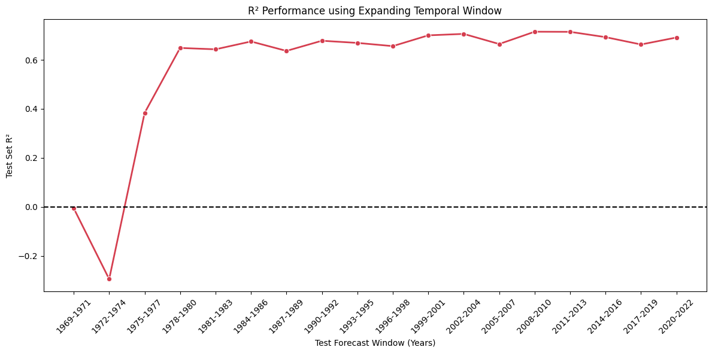

# Experiment 16: Expanding Window Temporal Cross-Validation

## Objective

Evaluate the model's forward-looking stability over time using an incremental forecasting approach. This addresses Experiment 2 from the proposal regarding expanding windows to validate if accumulating historical knowledge natively supports forecasting immediate-future years as the dataset grows dynamically.

## Methodology

1. **Iteration 1**: Map base geography + time patterns strictly over the initial 5 recorded years and test performance on the subsequent 3 years.
2. **Iteration N**: Anchor at the historical beginning but continue drastically expanding the training window by subsuming the previous 3-year test block. Re-train and test on the newly unobserved 3-year chunk.
3. **Aggregation**: Form a singular overall accuracy evaluation directly computing arrays of all generated real-event forecasts merged together.

## Overall Aggregated Prediction Performance

| Total Test Rows | Overall MAE | Overall RMSE | Overall R2 | Overall MAE_Norm | Overall RMSE_Norm |
| --- | --- | --- | --- | --- | --- |
| 154301.0 | 0.914 | 1.226 | 0.673 | 0.022 | 0.031 |

*Note: Out-of-time aggregated calculations measure how purely well the framework forecasted over its lifetime.*

## Iterative Temporal Forecasts

| Iteration | Train Window | Test Window | Train Rows | Test Rows | MAE | RMSE | R2 | MAE_Norm | RMSE_Norm |
| --- | --- | --- | --- | --- | --- | --- | --- | --- | --- |
| 1 | 1952-1968 | 1969-1971 | 3 | 149 | 1.876 | 2.382 | -0.005 | 0.04 | 0.067 |
| 2 | 1952-1971 | 1972-1974 | 152 | 752 | 1.949 | 2.474 | -0.294 | 0.04 | 0.051 |
| 3 | 1952-1974 | 1975-1977 | 904 | 3369 | 1.188 | 1.578 | 0.384 | 0.025 | 0.039 |
| 4 | 1952-1977 | 1978-1980 | 4273 | 4743 | 1.013 | 1.332 | 0.649 | 0.023 | 0.034 |
| 5 | 1952-1980 | 1981-1983 | 9016 | 6634 | 0.971 | 1.315 | 0.643 | 0.022 | 0.034 |
| 6 | 1952-1983 | 1984-1986 | 15650 | 6401 | 0.945 | 1.303 | 0.675 | 0.021 | 0.032 |
| 7 | 1952-1986 | 1987-1989 | 22051 | 7372 | 0.974 | 1.309 | 0.636 | 0.021 | 0.031 |
| 8 | 1952-1989 | 1990-1992 | 29423 | 9246 | 0.922 | 1.257 | 0.678 | 0.021 | 0.03 |
| 9 | 1952-1992 | 1993-1995 | 38669 | 8469 | 0.907 | 1.22 | 0.669 | 0.022 | 0.031 |
| 10 | 1952-1995 | 1996-1998 | 47138 | 11935 | 0.894 | 1.207 | 0.656 | 0.021 | 0.03 |
| 11 | 1952-1998 | 1999-2001 | 59073 | 12036 | 0.89 | 1.181 | 0.7 | 0.022 | 0.03 |
| 12 | 1952-2001 | 2002-2004 | 71109 | 11714 | 0.91 | 1.238 | 0.706 | 0.022 | 0.031 |
| 13 | 1952-2004 | 2005-2007 | 82823 | 11557 | 0.891 | 1.166 | 0.665 | 0.022 | 0.031 |
| 14 | 1952-2007 | 2008-2010 | 94380 | 11907 | 0.841 | 1.114 | 0.715 | 0.02 | 0.03 |
| 15 | 1952-2010 | 2011-2013 | 106287 | 11831 | 0.843 | 1.11 | 0.714 | 0.02 | 0.03 |
| 16 | 1952-2013 | 2014-2016 | 118118 | 12445 | 0.902 | 1.181 | 0.693 | 0.022 | 0.033 |
| 17 | 1952-2016 | 2017-2019 | 130563 | 12813 | 0.905 | 1.223 | 0.663 | 0.021 | 0.03 |
| 18 | 1952-2019 | 2020-2022 | 143376 | 10928 | 0.861 | 1.131 | 0.691 | 0.021 | 0.03 |

## Executive Summary & Next Steps

### Findings
**R² Fluctuation (Temporal Out-of-Sample Performance):** Evaluating real forward-forecasts over discrete three-year blocks introduces natural variance. The model successfully stabilizes its $R^2$ within a strong 0.65 to 0.75 range, but continues to fluctuate sequentially. This behavior occurs because isolated 3-year windows will organically deviate from long-term, historical baseline distributions due to short-term weather anomalies and ecological events.

*Note on Initial Iterations:* The severe $R^2$ collapses (negative values) witnessed in Iterations 1-3 are exclusively a data-volume artifact. The model was attempting to forecast massive testing volumes utilizing fewer than a thousand structural training rows. Genuine generalization logic takes hold and should be evaluated primarily starting from Iteration 5.

### Moving Forward
While expanding windows tests long-term knowledge accumulation, it carries **Ecological Drift**. If the lake climate structurally shifted from 1980 to 2015, forcing the model to explicitly weigh 1980's parameters identical to 2014's actively dilutes its modern predictability limit. This natively leads into the subsequent 'Sliding Window' experiment, which intentionally limits historical memory to shed antiquated climatic baselines.
