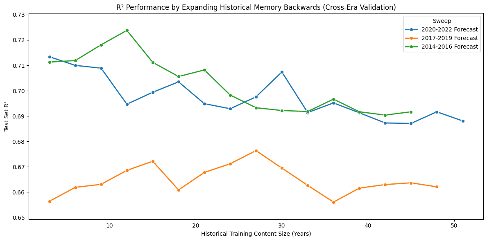

# Experiment 17: Backward Expanding (Ecological Drift)

## Objective

Assess whether adding progressively older training years helps or hurts out-of-sample Secchi predictions on fixed recent test blocks (**ecological drift / stale history**). **Part II** applies the same backward-expanding design to three eras (2020–2022, 2017–2019, 2014–2016) to see if the pattern is consistent across forecast targets.

## Methodology

1. **Multiple Fixed Testing Bounds**: Three separate test sets were anchored rigidly covering distinct eras (2020-2022, 2017-2019, 2014-2016).
2. **Backward Training Expansion**: For each test boundary, the model started training exclusively on its direct immediate 3 preceding years. Iterations expand backward in 3-year steps until either the calendar hits the dataset minimum or **training row count stops increasing** (no observations in the newly included past years), avoiding redundant refits on identical data.

## Multi-Era Backward-Expanding Forecasts

| Sweep | Iteration | Historical Horizon (Years) | Train Window | Train Rows | Test Rows | MAE | RMSE | R2 | MAE_Norm | RMSE_Norm |
| --- | --- | --- | --- | --- | --- | --- | --- | --- | --- | --- |
| 2020-2022 Forecast | 1 | 3 | 2017-2019 | 12813 | 10928 | 0.814 | 1.09 | 0.713 | 0.02 | 0.029 |
| 2020-2022 Forecast | 2 | 6 | 2014-2019 | 25258 | 10928 | 0.816 | 1.096 | 0.71 | 0.02 | 0.029 |
| 2020-2022 Forecast | 3 | 9 | 2011-2019 | 37089 | 10928 | 0.835 | 1.098 | 0.709 | 0.02 | 0.029 |
| 2020-2022 Forecast | 4 | 12 | 2008-2019 | 48996 | 10928 | 0.856 | 1.125 | 0.695 | 0.021 | 0.029 |
| 2020-2022 Forecast | 5 | 15 | 2005-2019 | 60553 | 10928 | 0.852 | 1.116 | 0.699 | 0.02 | 0.029 |
| 2020-2022 Forecast | 6 | 18 | 2002-2019 | 72267 | 10928 | 0.846 | 1.108 | 0.704 | 0.02 | 0.029 |
| 2020-2022 Forecast | 7 | 21 | 1999-2019 | 84303 | 10928 | 0.856 | 1.124 | 0.695 | 0.021 | 0.029 |
| 2020-2022 Forecast | 8 | 24 | 1996-2019 | 96238 | 10928 | 0.86 | 1.128 | 0.693 | 0.021 | 0.03 |
| 2020-2022 Forecast | 9 | 27 | 1993-2019 | 104707 | 10928 | 0.853 | 1.119 | 0.698 | 0.021 | 0.029 |
| 2020-2022 Forecast | 10 | 30 | 1990-2019 | 113953 | 10928 | 0.838 | 1.101 | 0.707 | 0.02 | 0.029 |
| 2020-2022 Forecast | 11 | 33 | 1987-2019 | 121325 | 10928 | 0.859 | 1.131 | 0.691 | 0.021 | 0.029 |
| 2020-2022 Forecast | 12 | 36 | 1984-2019 | 127726 | 10928 | 0.859 | 1.124 | 0.695 | 0.021 | 0.029 |
| 2020-2022 Forecast | 13 | 39 | 1981-2019 | 134360 | 10928 | 0.865 | 1.131 | 0.691 | 0.021 | 0.03 |
| 2020-2022 Forecast | 14 | 42 | 1978-2019 | 139103 | 10928 | 0.869 | 1.138 | 0.687 | 0.021 | 0.03 |
| 2020-2022 Forecast | 15 | 45 | 1975-2019 | 142472 | 10928 | 0.868 | 1.139 | 0.687 | 0.021 | 0.03 |
| 2020-2022 Forecast | 16 | 48 | 1972-2019 | 143224 | 10928 | 0.86 | 1.13 | 0.692 | 0.021 | 0.029 |
| 2020-2022 Forecast | 17 | 51 | 1969-2019 | 143373 | 10928 | 0.865 | 1.137 | 0.688 | 0.021 | 0.03 |
| 2017-2019 Forecast | 1 | 3 | 2014-2016 | 12445 | 12813 | 0.901 | 1.234 | 0.656 | 0.021 | 0.03 |
| 2017-2019 Forecast | 2 | 6 | 2011-2016 | 24276 | 12813 | 0.901 | 1.224 | 0.662 | 0.02 | 0.029 |
| 2017-2019 Forecast | 3 | 9 | 2008-2016 | 36183 | 12813 | 0.901 | 1.222 | 0.663 | 0.02 | 0.029 |
| 2017-2019 Forecast | 4 | 12 | 2005-2016 | 47740 | 12813 | 0.892 | 1.212 | 0.669 | 0.02 | 0.029 |
| 2017-2019 Forecast | 5 | 15 | 2002-2016 | 59454 | 12813 | 0.88 | 1.205 | 0.672 | 0.02 | 0.03 |
| 2017-2019 Forecast | 6 | 18 | 1999-2016 | 71490 | 12813 | 0.903 | 1.226 | 0.661 | 0.021 | 0.031 |
| 2017-2019 Forecast | 7 | 21 | 1996-2016 | 83425 | 12813 | 0.9 | 1.213 | 0.668 | 0.021 | 0.03 |
| 2017-2019 Forecast | 8 | 24 | 1993-2016 | 91894 | 12813 | 0.894 | 1.207 | 0.671 | 0.021 | 0.03 |
| 2017-2019 Forecast | 9 | 27 | 1990-2016 | 101140 | 12813 | 0.886 | 1.198 | 0.676 | 0.02 | 0.03 |
| 2017-2019 Forecast | 10 | 30 | 1987-2016 | 108512 | 12813 | 0.898 | 1.21 | 0.67 | 0.021 | 0.03 |
| 2017-2019 Forecast | 11 | 33 | 1984-2016 | 114913 | 12813 | 0.908 | 1.223 | 0.663 | 0.021 | 0.03 |
| 2017-2019 Forecast | 12 | 36 | 1981-2016 | 121547 | 12813 | 0.917 | 1.235 | 0.656 | 0.021 | 0.03 |
| 2017-2019 Forecast | 13 | 39 | 1978-2016 | 126290 | 12813 | 0.906 | 1.225 | 0.662 | 0.021 | 0.03 |
| 2017-2019 Forecast | 14 | 42 | 1975-2016 | 129659 | 12813 | 0.903 | 1.222 | 0.663 | 0.021 | 0.03 |
| 2017-2019 Forecast | 15 | 45 | 1972-2016 | 130411 | 12813 | 0.903 | 1.221 | 0.664 | 0.021 | 0.03 |
| 2017-2019 Forecast | 16 | 48 | 1969-2016 | 130560 | 12813 | 0.904 | 1.224 | 0.662 | 0.021 | 0.03 |
| 2014-2016 Forecast | 1 | 3 | 2011-2013 | 11831 | 12445 | 0.866 | 1.145 | 0.711 | 0.021 | 0.031 |
| 2014-2016 Forecast | 2 | 6 | 2008-2013 | 23738 | 12445 | 0.864 | 1.144 | 0.712 | 0.021 | 0.031 |
| 2014-2016 Forecast | 3 | 9 | 2005-2013 | 35295 | 12445 | 0.854 | 1.131 | 0.718 | 0.02 | 0.03 |
| 2014-2016 Forecast | 4 | 12 | 2002-2013 | 47009 | 12445 | 0.847 | 1.12 | 0.724 | 0.02 | 0.031 |
| 2014-2016 Forecast | 5 | 15 | 1999-2013 | 59045 | 12445 | 0.872 | 1.145 | 0.711 | 0.021 | 0.032 |
| 2014-2016 Forecast | 6 | 18 | 1996-2013 | 70980 | 12445 | 0.88 | 1.156 | 0.706 | 0.021 | 0.032 |
| 2014-2016 Forecast | 7 | 21 | 1993-2013 | 79449 | 12445 | 0.876 | 1.151 | 0.708 | 0.021 | 0.032 |
| 2014-2016 Forecast | 8 | 24 | 1990-2013 | 88695 | 12445 | 0.894 | 1.17 | 0.698 | 0.022 | 0.032 |
| 2014-2016 Forecast | 9 | 27 | 1987-2013 | 96067 | 12445 | 0.899 | 1.18 | 0.693 | 0.022 | 0.033 |
| 2014-2016 Forecast | 10 | 30 | 1984-2013 | 102468 | 12445 | 0.9 | 1.182 | 0.692 | 0.022 | 0.033 |
| 2014-2016 Forecast | 11 | 33 | 1981-2013 | 109102 | 12445 | 0.903 | 1.183 | 0.692 | 0.022 | 0.033 |
| 2014-2016 Forecast | 12 | 36 | 1978-2013 | 113845 | 12445 | 0.894 | 1.174 | 0.697 | 0.022 | 0.033 |
| 2014-2016 Forecast | 13 | 39 | 1975-2013 | 117214 | 12445 | 0.901 | 1.183 | 0.692 | 0.022 | 0.033 |
| 2014-2016 Forecast | 14 | 42 | 1972-2013 | 117966 | 12445 | 0.904 | 1.185 | 0.69 | 0.022 | 0.033 |
| 2014-2016 Forecast | 15 | 45 | 1969-2013 | 118115 | 12445 | 0.903 | 1.183 | 0.692 | 0.022 | 0.033 |

## Interpretations

### Findings
Results **depend on which test era** is held fixed; the table does not support a single rule that “more history always helps” or “always hurts.”

- **2020–2022 forecast:** $R^2$ is **highest** for the **shortest** train window (iteration 1: train 2017–2019, $R^2 \approx 0.713$). Very long histories sit **lower** on average (roughly **0.69–0.70** $R^2$ in the longest horizons), but the series is **not strictly monotone**—some mid-length windows outperform neighboring steps.
- **2017–2019 forecast:** The 3-year-only window is **not** best. $R^2$ **rises** when more past years are included and peaks near **iteration 9** (train 1990–2016, $R^2 \approx 0.676$) versus iteration 1 ($R^2 \approx 0.656$).
- **2014–2016 forecast:** Again, minimal history is not optimal: the best row is **iteration 4** (train 2002–2013, 12-year span, $R^2 \approx 0.724$) versus iteration 1 ($R^2 \approx 0.711$). Performance **softens** somewhat if history is pushed even further back beyond that peak.

Overall, older data sometimes **adds signal** and sometimes **dilutes** it, depending on era and horizon—consistent with **context-dependent** drift or non-stationarity, not a universal “short memory wins” law.

### Moving Forward
- **Choose training span using the backward-expanding curve (or time-based CV)** for the era you care about; avoid a fixed global cutoff not supported by these sweeps.
- **Document sweep-specific best windows** from the table when arguing for truncation.
- Optional: blocked CV, other learners, or spatial strata if drift differs by region or lake type.
