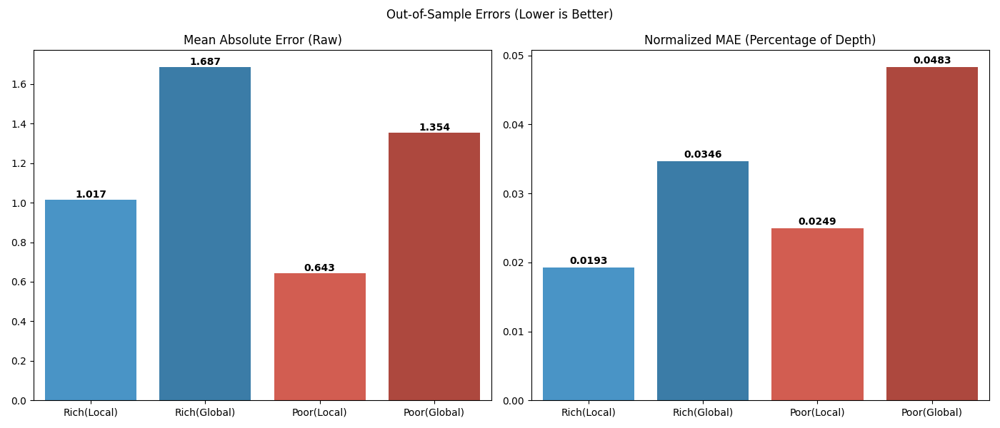
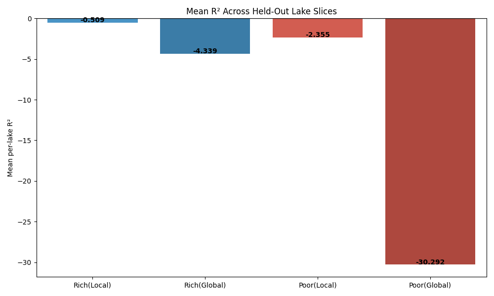

# Experiment 18: Localized Time-Series vs Global Transfer Learning

## Objective

Compare within-lake chronological training against strict leave-one-lake-out global training, and measure whether globally pooled knowledge transfers to data-poor lakes.

## Method

Evaluate two lake cohorts. Data-rich lakes require at least 500 observations and data-poor lakes require 15 to 40 observations. For each lake, split chronologically 80/20, train a local RandomForest on the lake-only training slice, and compare it against a global RandomForest trained on all other lakes only.

## Parameters

- local and global models: `RandomForestRegressor`
- `n_estimators=100`
- `max_depth=10`
- `random_state=42`
- feature set: `year`, `month`, `LATITUDE`, `LONGITUDE`, `AREA_ACRES`, `DEPTH_MAX_FEET`
- data-rich sample: first 50 lakes with at least 500 observations
- data-poor sample: first 50 lakes with 15 to 40 observations

## Results

### Data-Rich Lakes

| Model Scope | MAE | RMSE | R2 | MAE_Norm | RMSE_Norm |
| --- | --- | --- | --- | --- | --- |
| Local (within-lake train) | 1.017 | 1.265 | -0.509 | 0.019 | 0.024 |
| LOLO global (all lakes except target) | 1.687 | 1.91 | -4.339 | 0.035 | 0.039 |

### Data-Poor Lakes

| Model Scope | MAE | RMSE | R2 | MAE_Norm | RMSE_Norm |
| --- | --- | --- | --- | --- | --- |
| Local (within-lake train) | 0.643 | 0.779 | -2.355 | 0.025 | 0.03 |
| LOLO global (all lakes except target) | 1.354 | 1.458 | -30.292 | 0.048 | 0.052 |

### Diagnostic Notes

- Data-rich winner by MAE: Local
- Data-poor winner by MAE: Local
- Rich global MAE vs local MAE: 1.687 vs 1.017
- Poor global MAE vs local MAE: 1.354 vs 0.643

## Next Step

Use the transfer-learning outcome to decide whether later chronological and leave-one-lake-out model families should prioritize lake-specific tuning or pooled cross-lake structure.
