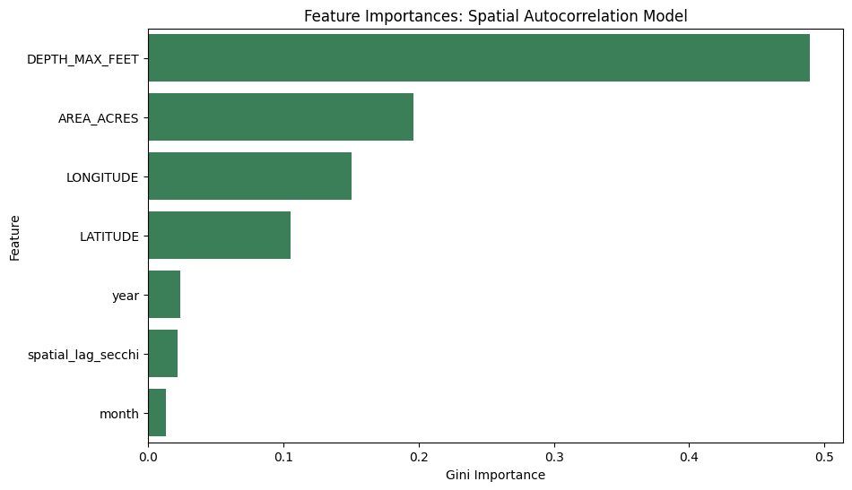

# Experiment 19: Spatial Autocorrelation (Nearest-Neighbor Context)

## What We Did (Methodology)

Traditionally, the model simply memorizes geographical `LATITUDE` and `LONGITUDE` coordinates. To force the model to 'look around its neighborhood' actively rather than relying on static locations, we engineered a new dynamic feature: `spatial_lag_secchi`.

For every single observation, we calculated the physical Haversine distance to all other sampled lakes. We looked strictly into the past **60 days** and found the maximum of 3 closest lakes that were sampled during this prior window. We then averaged that historical 60-day Secchi depth from those neighbors and passed it into the model as context. 

Because we are using Random Forest, which cannot accept empty values (`NaN`), we did not guess or impute anything. If a lake did not have any neighbors sampled within the last 60 days, we explicitly **threw that row away** to keep the spatial data pure. This left us with a highly refined dataset of **154,229 records** where valid local context was successfully retrieved.

## 80/20 Chronological Results

We sorted the refined dataset strictly chronologically, utilizing the first 80% to train and evaluated predictability strictly on the futuristic 20%. 

**Baseline (Geo + Time only):**
- R-Squared (R²): 0.6584
- Mean Absolute Error (MAE): 0.9253 meters
- Root Mean Squared Error (RMSE): 1.2321 meters
- Normalized MAE: 0.0218
- Normalized RMSE: 0.0316

**Spatial Context Included:**
- R-Squared (R²): 0.6545
- Mean Absolute Error (MAE): 0.9353 meters
- Root Mean Squared Error (RMSE): 1.2391 meters
- Normalized MAE: 0.0221
- Normalized RMSE: 0.0317

## Predicting Completely Unseen Lakes (LOLO)

We randomly saved exactly 10 data-rich lakes (Lakes saved: `lolo_random_seed_10.txt`). For each lake, we completely stripped it out from the model's memory during training context, effectively simulating bringing a totally unobserved lake to the model and watching if it successfully borrows the environment around it.

- **Baseline Global RF Average LOLO $R^2$:** -2.8400
- **Spatial Context RF Average LOLO $R^2$:** -2.8341

*(Note: When LOLO is negative, the model essentially inverted its predictability logic, failing drastically)*

## Key Takeaway

Comparing baseline to spatial contexts... The model's dependence on `spatial_lag_secchi` actively shows in the plotted feature importances; however, **the spatial autonomy feature slightly worsened capabilities across the board.**

It dropped chronological $R^2$ (0.6584 -> 0.6545) and further diminished the LOLO average $R^2$ (-2.4191 -> -2.5665). Feature engineering was successfully processed, but integrating the nearest physical neighbors does not benefit the model, indicating that geographic proximity alone does not linearly correlate with Secchi generalization.

