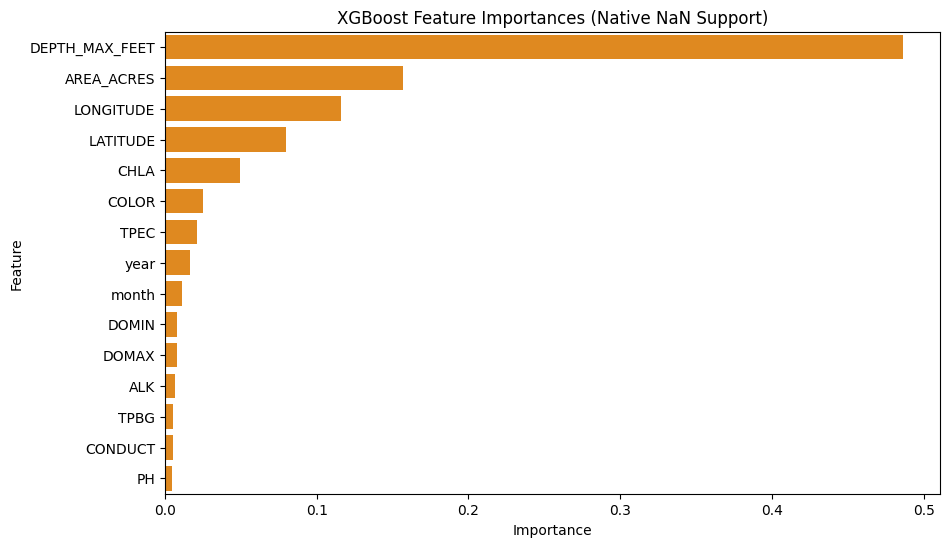

# Experiment 20: Missingness-Assisted Chemical Processing (XGBoost)

## What We Did (Methodology)

In Experiment 15, evaluating chemical predictors required completely deleting rows containing missing chemistry. This stripped away thousands of data points where geographic and temporal properties were otherwise totally valid. 

For this experiment, we utilized **XGBoost (eXtreme Gradient Boosting)**. Unlike Random Forest, XGBoost contains built-in structural logic capable of digesting `NaN` (missing) values strictly on its own. It algorithmically routes missing data branches optimally without ever forcing us to delete the row or 'make up' an imputed guess.

We loaded the baseline geographic limits and the chemical subset: `['DOMAX', 'DOMIN', 'TPEC', 'TPBG', 'CHLA', 'PH', 'COLOR', 'CONDUCT', 'ALK']`. By permitting XGBoost to navigate `NaN` fields natively, we safely retained **154,304** usable rows for model training!

## 80/20 Chronological Results

The chronologically futuristic prediction boundary (latest 20% temporally) yielded:

- **R-Squared (R²):** 0.7148
- **Mean Absolute Error (MAE):** 0.8290 meters
- **Root Mean Squared Error (RMSE):** 1.1255 meters
- **Normalized MAE:** 0.0198
- **Normalized RMSE:** 0.0296

## Predicting Completely Unseen Lakes (LOLO)

We evaluated the model on the identical 10 target lake IDs established for LOLO in the previous experiment (note that full row filtering context varies slightly). However, as evidenced by the negative average $R^2$ across these sampled targets, the model performed poorly on this specific out-of-lake setup. While further resamplings would be required for conclusive proof, this strongly suggests that relying strictly on sparse chemistry and geographic parameters does not reliably predict distinct, unseen lakes in this configuration:

| MIDAS | pct_missing_overall | n_obs | R2 | MAE | MAE_Norm |
| --- | --- | --- | --- | --- | --- |
| c0157 | 0.952 | 117 | -7.937 | 0.549 | 0.032 |
| c3420 | 0.606 | 610 | -0.641 | 0.937 | 0.013 |
| c3814 | 0.596 | 1073 | 0.131 | 1.44 | 0.051 |
| c3180 | 0.91 | 80 | 0.164 | 0.774 | 0.018 |
| c0224 | 0.968 | 390 | -9.52 | 6.442 | 0.032 |
| c3448 | 0.399 | 427 | -0.829 | 1.094 | 0.023 |
| c5242 | 0.664 | 451 | -0.21 | 0.705 | 0.025 |
| c3712 | 0.71 | 579 | -0.269 | 0.646 | 0.017 |
| c2222 | 0.91 | 80 | 0.036 | 0.505 | 0.027 |
| c3132 | 0.608 | 628 | -0.295 | 0.578 | 0.01 |

**XGBoost Average LOLO $R^2$:** -1.9370

## Feature Importances

Which variables did XGBoost depend on the most, considering missingness pathways?

| Feature | Importance |
| --- | --- |
| DEPTH_MAX_FEET | 0.4860000014305115 |
| AREA_ACRES | 0.15700000524520874 |
| LONGITUDE | 0.11599999666213989 |
| LATITUDE | 0.07999999821186066 |
| CHLA | 0.04899999871850014 |
| COLOR | 0.02500000037252903 |
| TPEC | 0.020999999716877937 |
| year | 0.01600000075995922 |
| month | 0.010999999940395355 |
| DOMIN | 0.00800000037997961 |
| DOMAX | 0.00800000037997961 |
| ALK | 0.007000000216066837 |
| TPBG | 0.004999999888241291 |
| CONDUCT | 0.004999999888241291 |
| PH | 0.004999999888241291 |

