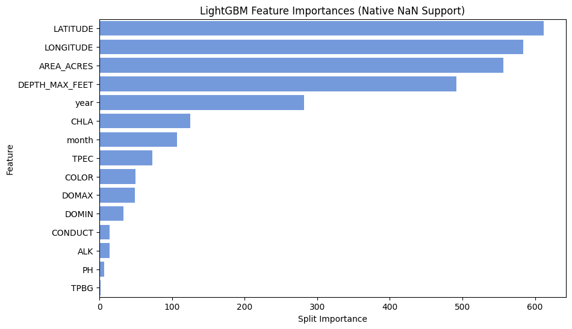

# Experiment 21: Alternate Non-Linear Missingness Architecture (LightGBM)

## What We Did (Methodology)

Following Experiment 20, we deployed **LightGBM** (Light Gradient Boosting Machine). Similar to XGBoost, LightGBM is inherently structurally designed to intercept missing (`NaN`) values efficiently. It bins continuous features into discrete histograms natively, vastly reducing the absolute memory footprint and drastically accelerating training speed. 

Exactly replicating the XGBoost structure, we completely passed the unfiltered dataset containing blank chemical profiles directly to LightGBM. It dynamically routed `NaN` queries dynamically matching baseline geographical subsets while simultaneously extracting valid internal chemical states when successfully recorded.

## 80/20 Chronological Results

Predicting strictly out-of-time (the unobserved futuristic 20% validation split):

- **R-Squared (R²):** 0.7132
- **Mean Absolute Error (MAE):** 0.8487 meters
- **Root Mean Squared Error (RMSE):** 1.1288 meters
- **Normalized MAE:** 0.0203
- **Normalized RMSE:** 0.0295

## Predicting Completely Unseen Lakes (LOLO)

We evaluated the model on the identically seeded 10 target lake IDs to quantify LightGBM's capability. Similar to the XGBoost run, the highly negative average $R^2$ on these sampled targets indicates the model performed poorly generalizing out-of-lake. While more extensive validation is needed to be conclusive, this suggests geographically isolated sparse models struggle significantly on unseen topographies:

| MIDAS | pct_missing_overall | n_obs | R2 | MAE | MAE_Norm |
| --- | --- | --- | --- | --- | --- |
| c0157 | 0.952 | 117 | -19.44 | 0.899 | 0.053 |
| c3420 | 0.606 | 610 | -1.223 | 1.093 | 0.015 |
| c3814 | 0.596 | 1073 | 0.125 | 1.436 | 0.051 |
| c3180 | 0.91 | 80 | 0.138 | 0.699 | 0.016 |
| c0224 | 0.968 | 390 | -6.189 | 5.236 | 0.026 |
| c3448 | 0.399 | 427 | -0.067 | 0.779 | 0.016 |
| c5242 | 0.664 | 451 | -0.111 | 0.643 | 0.023 |
| c3712 | 0.71 | 579 | -0.027 | 0.602 | 0.016 |
| c2222 | 0.91 | 80 | -0.176 | 0.541 | 0.028 |
| c3132 | 0.608 | 628 | -1.894 | 0.928 | 0.016 |

**LightGBM Average LOLO $R^2$:** -2.8863

## Feature Importances

(Measured using split parameter frequency—how often LightGBM explicitly decided to route decision boundaries dependent strictly upon the chemical nodes).

| Feature | Importance |
| --- | --- |
| LATITUDE | 612 |
| LONGITUDE | 584 |
| AREA_ACRES | 556 |
| DEPTH_MAX_FEET | 492 |
| year | 282 |
| CHLA | 125 |
| month | 107 |
| TPEC | 73 |
| COLOR | 50 |
| DOMAX | 49 |
| DOMIN | 33 |
| CONDUCT | 14 |
| ALK | 14 |
| PH | 7 |
| TPBG | 2 |

