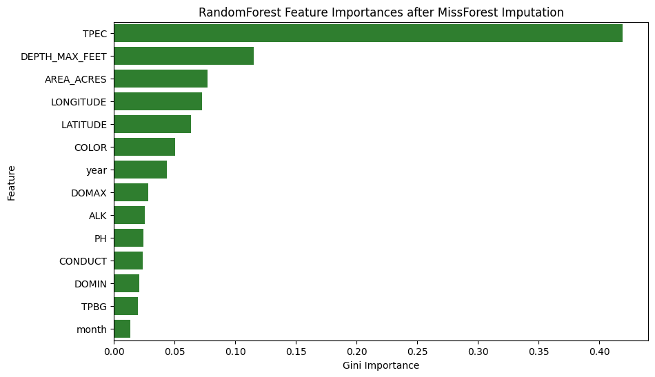

# Experiment 22: MissForest Chronological Test

## Objective

Evaluate whether MissForest-style imputation improves the chronological Secchi baseline once chemical features are allowed into the feature set.

## Method

Create a time-sorted 80/20 split, fit the imputer only on the training slice, transform train and test features separately, and train a downstream RandomForest predictor on the imputed training data.

## Parameters

Imputer:
- `IterativeImputer`
- estimator: `RandomForestRegressor`
- `n_estimators=50`
- `max_depth=10`
- `max_iter=3`
- `random_state=42`

Predictor:
- `RandomForestRegressor`
- `n_estimators=100`
- `random_state=42`

Feature policy: baseline geographic and temporal features plus valid chemistry columns, excluding `CHLA`.

## Results

### Chronological Test Metrics

- R^2: 0.6633
- MSE: 1.4960 m^2
- MAE: 0.8948 m
- Normalized MSE: 0.0010
- Normalized MAE: 0.0213

### Top Feature Importances

| Feature | Importance |
| --- | --- |
| TPEC | 0.419 |
| DEPTH_MAX_FEET | 0.116 |
| AREA_ACRES | 0.077 |
| LONGITUDE | 0.073 |
| LATITUDE | 0.064 |
| COLOR | 0.051 |
| year | 0.044 |
| DOMAX | 0.028 |
| ALK | 0.026 |
| PH | 0.025 |
| CONDUCT | 0.024 |
| DOMIN | 0.021 |
| TPBG | 0.02 |
| month | 0.014 |

## Next Step

Use this imputation-aware baseline as the launch point for leave-one-lake-out testing, feature elimination, sample-threshold experiments, and dense-lake variants.
