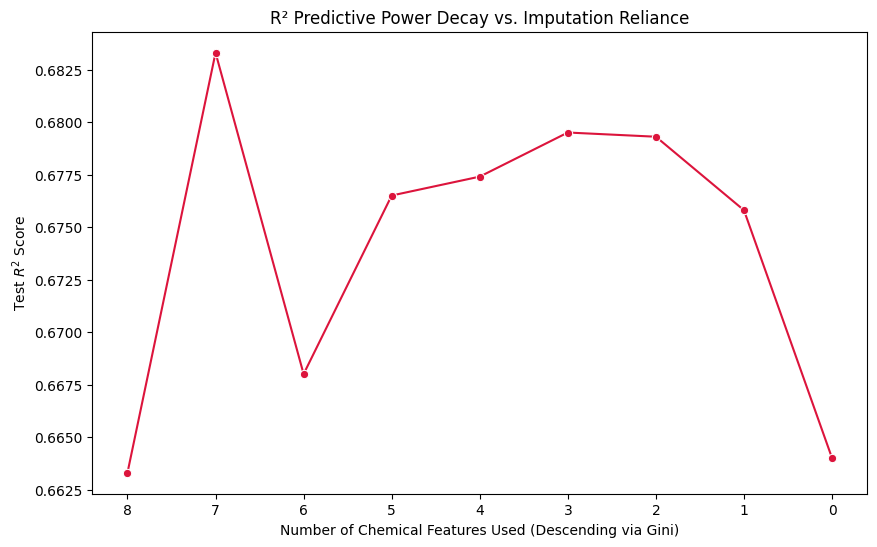

# Experiment 24: Iterative Backward Elimination (MissForest)

## What We Did

In Experiment 24, we ran recursive backward elimination on chemical features.
The goal was to see how many chemicals we can remove while keeping prediction quality.

We followed this process:
1. Used a chronological 80/20 split.
2. Started with all available chemical features.
3. Imputed missing values with MissForest-style imputation (`IterativeImputer` + Random Forest).
4. Trained a Random Forest predictor and recorded test $R^2$ and MAE.
5. Ranked only chemical features by Gini importance.
6. Removed the least important chemical.
7. Repeated until no chemicals remained, leaving only base features (`LATITUDE`, `LONGITUDE`, `AREA_ACRES`, `DEPTH_MAX_FEET`, year, month).

## Trade-off Curve Results

The table and chart below show how performance changes as chemical features are removed.
This helps identify which chemicals add useful signal and when performance starts to decline.

| Iteration | Chemical Count | R2 | MAE | Chemicals Used | Dropped After This Run |
| --- | --- | --- | --- | --- | --- |
| 1 | 8 | 0.663 | 0.895 | DOMAX, DOMIN, TPEC, TPBG, PH, COLOR, CONDUCT, ALK | TPBG |
| 2 | 7 | 0.683 | 0.867 | DOMAX, DOMIN, TPEC, PH, COLOR, CONDUCT, ALK | DOMAX |
| 3 | 6 | 0.668 | 0.878 | DOMIN, TPEC, PH, COLOR, CONDUCT, ALK | ALK |
| 4 | 5 | 0.676 | 0.866 | DOMIN, TPEC, PH, COLOR, CONDUCT | CONDUCT |
| 5 | 4 | 0.677 | 0.874 | DOMIN, TPEC, PH, COLOR | DOMIN |
| 6 | 3 | 0.68 | 0.872 | TPEC, PH, COLOR | PH |
| 7 | 2 | 0.679 | 0.87 | TPEC, COLOR | COLOR |
| 8 | 1 | 0.676 | 0.873 | TPEC | TPEC |
| 9 | 0 | 0.664 | 0.893 | None | N/A |

