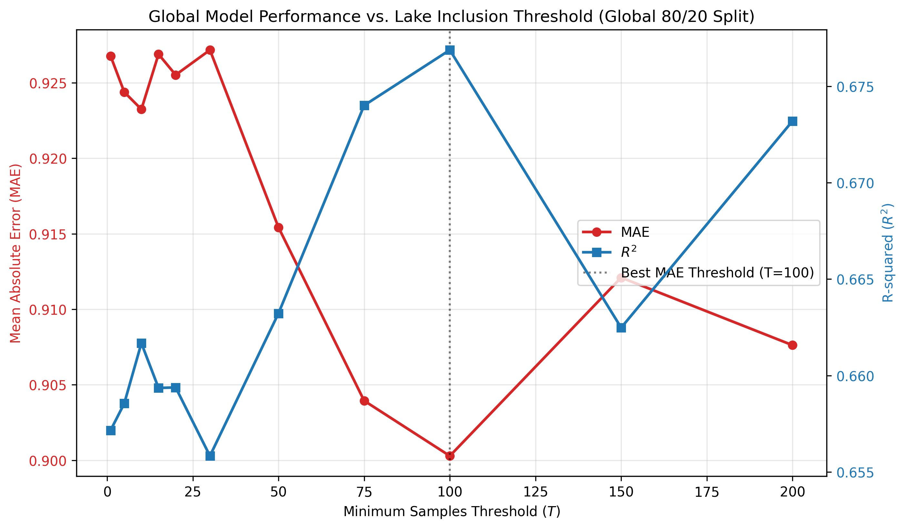

# Experiment 25: Minimum Sample Inclusion Threshold (Global Temporal Split)

## Objective

Determine the optimal minimum sample threshold ($T$) for lake inclusion by applying the exact global chronological split methodology from Experiment 10. The only variable changing between rounds is the threshold $T$.

## Methodology

Here is exactly how we ran the test, mirroring the exact methodology of the Experiment 10 Baseline Model:

1. **Filtering the dataset:** In each round, we picked a "minimum sample threshold" ($T$). We completely removed any lake from the entire dataset if it had fewer than $T$ historical records across all time.
2. **Global Chronological 80/20 Split:** For the lakes that survived the filter, we sorted all rows strictly by date. We took the first 80% of rows (chronologically) as the **Global Training Set** and the final 20% of rows as the **Global Test Set**. This perfectly mirrors Experiment 10 and prevents lookahead bias.
3. **Data Cleaning & Features Used:** We did **not** use any imputation. The model was trained using the baseline feature set: `year`, `month`, `LATITUDE`, `LONGITUDE`, `AREA_ACRES`, and `DEPTH_MAX_FEET`.
4. **Training and Scoring:** We trained a Random Forest model on the training set and scored it on the out-of-time global test set.
5. **Comparing the results:** We track exactly how $R^2$ and MAE change strictly as a function of the minimum sample threshold $T$.
6. **Primary selection rule:** The recommended threshold is selected by minimizing **MAE** (with $R^2$ used as a secondary validation signal).

## Threshold Evaluation Results

| Threshold (Min Samples) | Lakes Included | Train Rows | Test Rows | R2 | MAE | MAE_Norm |
| --- | --- | --- | --- | --- | --- | --- |
| 1.0 | 994.0 | 123443.0 | 30861.0 | 0.657 | 0.927 | 0.022 |
| 5.0 | 702.0 | 122982.0 | 30746.0 | 0.659 | 0.924 | 0.022 |
| 10.0 | 595.0 | 122433.0 | 30609.0 | 0.662 | 0.923 | 0.022 |
| 15.0 | 561.0 | 122118.0 | 30530.0 | 0.659 | 0.927 | 0.022 |
| 20.0 | 530.0 | 121703.0 | 30426.0 | 0.659 | 0.926 | 0.022 |
| 30.0 | 492.0 | 120984.0 | 30246.0 | 0.656 | 0.927 | 0.022 |
| 50.0 | 434.0 | 119200.0 | 29800.0 | 0.663 | 0.915 | 0.021 |
| 75.0 | 385.0 | 116813.0 | 29204.0 | 0.674 | 0.904 | 0.021 |
| 100.0 | 357.0 | 114888.0 | 28723.0 | 0.677 | 0.9 | 0.02 |
| 150.0 | 311.0 | 110576.0 | 27644.0 | 0.662 | 0.912 | 0.02 |
| 200.0 | 278.0 | 106070.0 | 26518.0 | 0.673 | 0.908 | 0.02 |

## Interpretations and Baseline

### Key Findings

This experiment perfectly controls for the methodology established in Experiment 10, changing *only* the minimum sample inclusion threshold $T$. By sorting the entire region chronologically, we are asking: *If we predict the region's absolute future, does dropping lakes with sparse history help the global model generalize better?*

**Results Summary:**
- Using MAE as the primary selection metric, the optimal threshold plateaus around **$T = 100 $** samples.
- At this threshold, the global model achieved an MAE of **0.9003** and an $R^2$ of **0.6769**.
- Using a global temporal split, the baseline $R^2$ sits around ~0.65 to 0.67 (consistent with Experiment 10). We observe that varying the threshold does not drastically alter the baseline $R^2$, but optimizing it provides fractional improvements in MAE.

### Recommendation
Based on this globally-split evaluation and MAE-first selection rule, the optimal minimum sample threshold is **100**. This ensures we are feeding the region-wide model the highest quality temporal patterns without unnecessarily discarding valid historical context.
