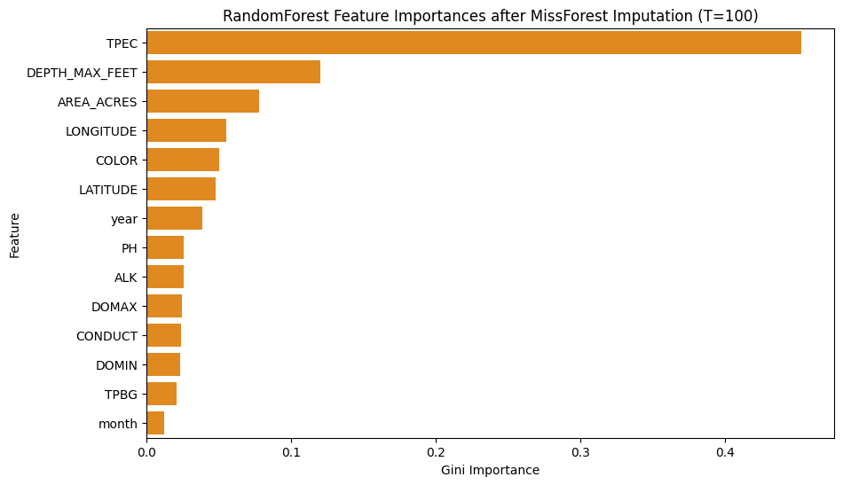
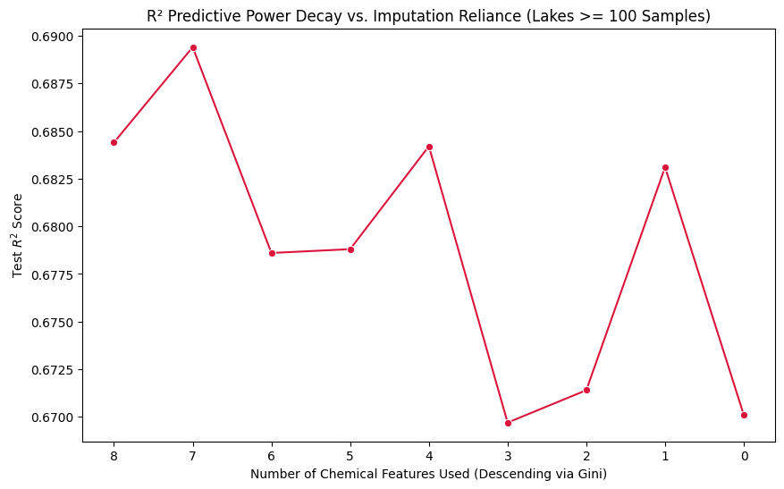

# Experiment 26: Optimal Dense-Lake Forecasting (Imputation + Elimination)

## What We Did

In this experiment, we combined three core methodologies to identify the absolute optimal model structure:

1. **Experiment 25 ($T \ge 100$ filtering):** We removed any lake from the dataset with fewer than 100 historical samples to ensure the imputer and model are fed high-quality, dense histories.
2. **Experiment 22 (MissForest Imputation):** We imputed missing chemical features using an `IterativeImputer` with a Random Forest core, fitted strictly on the chronologically split training set.
3. **Experiment 24 (Backward Elimination):** We recursively dropped the lowest-importance chemical feature to see how $T \ge 100$ impacts the decay of predictive power.

## Part 1: Base MissForest Results (Threshold = 100)

The performance of the model using *all* valid imputed chemical features on the dense ($T \ge 100$) lake subset:

- **R-Squared (R²):** 0.6844
- **Mean Squared Error (MSE):** 1.4008 meters²
- **Mean Absolute Error (MAE):** 0.8695 meters
- **Normalized MSE:** 0.0008
- **Normalized MAE:** 0.0196

Note: normalized errors divide SECCHI residuals by `DEPTH_MAX_FEET`, so this metric is a depth-relative ratio.

| Feature | Importance |
| --- | --- |
| TPEC | 0.453 |
| DEPTH_MAX_FEET | 0.12 |
| AREA_ACRES | 0.078 |
| LONGITUDE | 0.055 |
| COLOR | 0.05 |
| LATITUDE | 0.048 |
| year | 0.039 |
| PH | 0.026 |
| ALK | 0.026 |
| DOMAX | 0.024 |
| CONDUCT | 0.024 |
| DOMIN | 0.023 |
| TPBG | 0.021 |
| month | 0.012 |

## Part 2: Iterative Backward Elimination

We progressively removed the lowest-impact chemical feature to see if imputation on highly-dense lakes provides durable signal, or if it can be stripped away.

| Iteration | Chemical Count | R2 | MAE | Chemicals Used | Dropped After This Run |
| --- | --- | --- | --- | --- | --- |
| 1 | 8 | 0.684 | 0.87 | DOMAX, DOMIN, TPEC, TPBG, PH, COLOR, CONDUCT, ALK | TPBG |
| 2 | 7 | 0.689 | 0.862 | DOMAX, DOMIN, TPEC, PH, COLOR, CONDUCT, ALK | DOMAX |
| 3 | 6 | 0.679 | 0.871 | DOMIN, TPEC, PH, COLOR, CONDUCT, ALK | CONDUCT |
| 4 | 5 | 0.679 | 0.874 | DOMIN, TPEC, PH, COLOR, ALK | ALK |
| 5 | 4 | 0.684 | 0.863 | DOMIN, TPEC, PH, COLOR | DOMIN |
| 6 | 3 | 0.67 | 0.869 | TPEC, PH, COLOR | PH |
| 7 | 2 | 0.671 | 0.874 | TPEC, COLOR | COLOR |
| 8 | 1 | 0.683 | 0.866 | TPEC | TPEC |
| 9 | 0 | 0.67 | 0.884 | None | N/A |

## Interpretations

### How does $T \ge 100$ affect imputation reliance?

By strictly filtering the lakes before performing MissForest imputation and backward elimination, we can compare these results directly to Experiment 24.
If the $R^2$ curve stays higher for longer (or decays slower) here than it did in Experiment 24, it proves that providing the imputer with dense, $T \ge 100$ histories creates *meaningful, high-fidelity chemical guesses* rather than just statistical noise. Conversely, it allows us to see precisely how many chemical features are strictly necessary to maintain peak accuracy when working with high-quality lakes.
