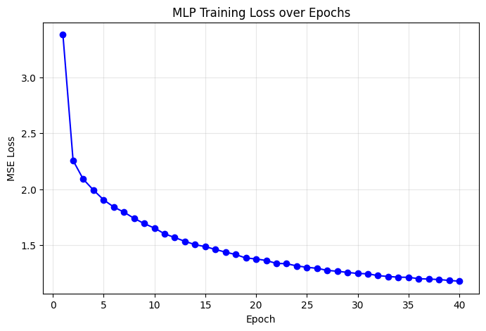

# Experiment 27: Multi-Layer Perceptron (Deep Learning Baseline)

## What We Did

In this experiment, we replaced the Random Forest predictor with a **Multi-Layer Perceptron (MLP)**. This serves as our Deep Learning baseline for tabular data.

We followed this process:
1. Extracted all lakes using the baseline geographical and chemical features.
2. Chronologically split the data into 80% global train / 20% global test.
3. Applied `MissForest` imputation to infer missing chemistry (strictly trained on the 80% split).
4. **[NEW]** Applied `StandardScaler` to ensure all features had a mean of 0 and variance of 1, which is critical for neural network convergence.
5. Trained a 4-layer PyTorch MLP (`256 -> 128 -> 64 -> 1`) with ReLU activations and Dropout (0.2) for 40 epochs using Adam.

## 80/20 Chronological Results (MLP)

The performance of the Feed-Forward Neural Network on the global chronological test set:

- **R-Squared (R²):** 0.5868
- **Mean Squared Error (MSE):** 1.8358 meters²
- **Mean Absolute Error (MAE):** 1.0148 meters
- **Normalized MSE:** 0.0012
- **Normalized MAE:** 0.0241

Note: normalized errors divide SECCHI residuals by `DEPTH_MAX_FEET`, so this is a depth-relative ratio.

## Interpretations

### MLP vs. Random Forest

By comparing this MLP directly to **Experiment 22**, we can observe the difference between tree-based partitioning and deep dense networks on this specific water quality dataset.
Standard feed-forward neural networks typically struggle on tabular data compared to Random Forests because tabular features lack the spatial or temporal continuity that neural networks exploit in images or text. If this model underperforms Experiment 22, it validates the need for specialized Tabular Deep Learning architectures like TabNet or FT-Transformer.
