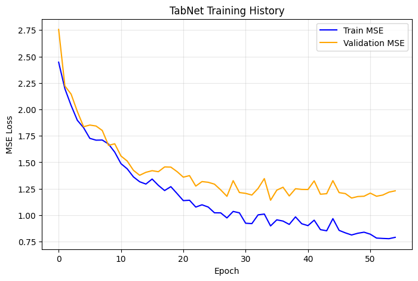
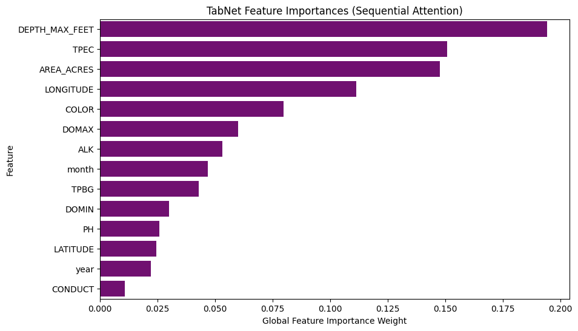

# Experiment 28: TabNet (Tabular Deep Learning)

## What We Did

In this experiment, we utilized **TabNet (by Google)**, a state-of-the-art Deep Learning architecture specifically designed for tabular data. Unlike standard neural networks, TabNet uses 'sequential attention' to choose which features to look at during each step of prediction, effectively mimicking the behavior of a Random Forest but using deep learning.

We followed this process:
1. Applied the same 80/20 chronological split and `MissForest` imputation as Experiment 22.
2. Built an internal 90/10 split inside the training window to create a chronological validation set.
3. Scaled the imputed features using `StandardScaler`.
4. Trained the `TabNetRegressor` using an Adam optimizer, tracking MSE on the validation split for early stopping (the final test set remained untouched until final scoring).

## 80/20 Chronological Results (TabNet)

The performance of TabNet on the global chronological test set:

- **R-Squared (R²):** 0.5771
- **Mean Squared Error (MSE):** 1.8787 meters²
- **Mean Absolute Error (MAE):** 1.0443 meters
- **Normalized MSE:** 0.0013
- **Normalized MAE:** 0.0251

Note: normalized errors divide SECCHI residuals by `DEPTH_MAX_FEET`, so this is a depth-relative ratio.

## Feature Importances

Because TabNet uses sequential attention, it is highly interpretable. Below is the global importance TabNet assigned to each feature when making its decisions:

| Feature | Importance |
| --- | --- |
| DEPTH_MAX_FEET | 0.194 |
| TPEC | 0.151 |
| AREA_ACRES | 0.148 |
| LONGITUDE | 0.111 |
| COLOR | 0.08 |
| DOMAX | 0.06 |
| ALK | 0.053 |
| month | 0.047 |
| TPBG | 0.043 |
| DOMIN | 0.03 |
| PH | 0.026 |
| LATITUDE | 0.025 |
| year | 0.022 |
| CONDUCT | 0.011 |

## Interpretations

### TabNet vs. Random Forest

If TabNet outperforms the standard MLP (Experiment 27), it confirms that tabular-specific attention mechanisms are necessary for neural networks to process this heterogeneous water quality data.
Comparing this directly to **Experiment 22 ($R^2$ ~0.66)** reveals whether Google's Tabular Deep Learning framework can actually beat a highly-tuned traditional Random Forest ensemble on chronological environmental forecasting.
