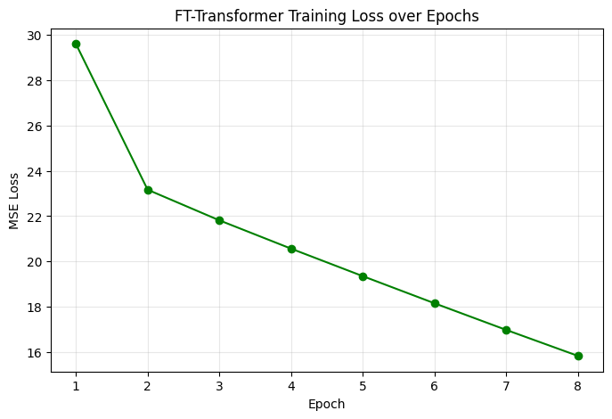

# Experiment 29: FT-Transformer Chronological Baseline

## Objective

Benchmark an FT-Transformer on the same MissForest-imputed chronological split used by the other advanced tabular baselines.

## Method

Apply the Experiment 22 feature policy and chronological 80/20 split, impute the feature matrix with IterativeImputer plus RandomForest, standardize the imputed inputs, cap the train/test row counts for tractable CPU execution, and train an FT-Transformer regressor on the sampled training slice only.

## Parameters

Imputation and preprocessing:
- `IterativeImputer`
- estimator: `RandomForestRegressor`
- `n_estimators=50`
- `max_depth=10`
- `max_iter=3`
- `StandardScaler`
- training rows capped at `30000`
- test rows capped at `10000`

FT-Transformer:
- `dim=16`
- `depth=2`
- `heads=4`
- `attn_dropout=0.1`
- `ff_dropout=0.1`
- optimizer: `Adam(lr=0.001)`
- `epochs=8`
- `batch_size=2048`

Feature policy: baseline geographic and temporal features plus valid chemistry columns, excluding `CHLA`.

## Results

### Chronological Test Metrics

- R^2: -2.8842
- MSE: 17.9639 m^2
- MAE: 3.6802 m
- Normalized MSE: 0.0087
- Normalized MAE: 0.0806

### Training Diagnostics

The figure below records epoch-level training loss for the final run.

## Next Step

Compare this deep-learning baseline directly against the MissForest RandomForest, MLP, and TabNet results before deciding whether transformer-based tabular models deserve a place in the final dashboard model shortlist.
