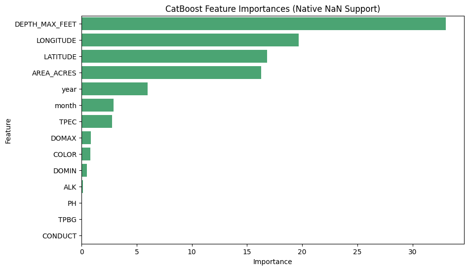

# Experiment 33: Native Missingness Chemical Processing (CatBoost)

## What We Did (Methodology)

We deployed **CatBoost** on the same chemistry set used in the later non-CHLA experiments. Like the other boosted-tree baselines, CatBoost can retain rows with missing chemistry instead of forcing global imputation or row deletion. This lets us preserve the same broad geographic-temporal training base while still testing whether chemistry helps when present, while explicitly excluding `CHLA`.

We loaded the baseline geographic limits and the chemical subset: `['DOMAX', 'DOMIN', 'TPEC', 'TPBG', 'PH', 'COLOR', 'CONDUCT', 'ALK']`. By preserving native missingness, CatBoost trained on **154,304** usable rows.

## 80/20 Chronological Results

Predicting strictly out-of-time (the latest 20% temporal split) yielded:

- **R-Squared (R²):** 0.7131
- **Mean Absolute Error (MAE):** 0.8483 meters
- **Root Mean Squared Error (RMSE):** 1.1289 meters
- **Normalized MAE:** 0.0203
- **Normalized RMSE:** 0.0299

## Predicting Completely Unseen Lakes (LOLO)

We evaluated CatBoost on the same seeded 10 target lake IDs used by the XGBoost and LightGBM tests. This keeps the comparison aligned across boosting families even though full row context can differ slightly. The table below shows lake-level performance and the overall average LOLO $R^2$ for this run:

| MIDAS | pct_missing_overall | n_obs | R2 | MAE | MAE_Norm |
| --- | --- | --- | --- | --- | --- |
| c0157 | 0.952 | 117 | -2.43 | 0.333 | 0.02 |
| c3420 | 0.606 | 610 | -2.204 | 1.378 | 0.019 |
| c3814 | 0.596 | 1073 | -0.047 | 1.622 | 0.058 |
| c3180 | 0.91 | 80 | 0.237 | 0.691 | 0.016 |
| c0224 | 0.968 | 390 | -9.943 | 6.61 | 0.033 |
| c3448 | 0.399 | 427 | 0.171 | 0.661 | 0.014 |
| c5242 | 0.664 | 451 | 0.102 | 0.592 | 0.021 |
| c3712 | 0.71 | 579 | -0.308 | 0.7 | 0.018 |
| c2222 | 0.91 | 80 | 0.208 | 0.43 | 0.023 |
| c3132 | 0.608 | 628 | -0.362 | 0.619 | 0.01 |

**CatBoost Average LOLO $R^2$:** -1.4574

## Feature Importances

Measured using CatBoost's native feature importance scores after training with missing values left intact.

| Feature | Importance |
| --- | --- |
| DEPTH_MAX_FEET | 33.014 |
| LONGITUDE | 19.692 |
| LATITUDE | 16.839 |
| AREA_ACRES | 16.273 |
| year | 6.006 |
| month | 2.915 |
| TPEC | 2.789 |
| DOMAX | 0.863 |
| COLOR | 0.819 |
| DOMIN | 0.502 |
| ALK | 0.148 |
| PH | 0.06 |
| TPBG | 0.045 |
| CONDUCT | 0.036 |

