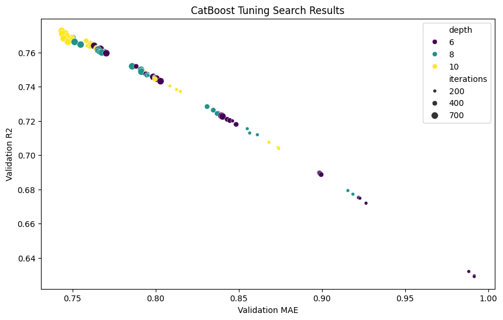
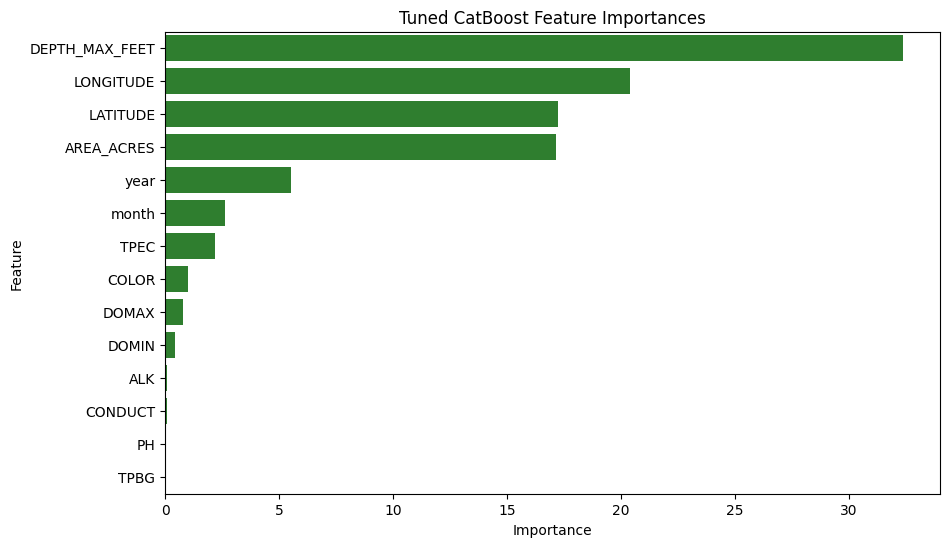

# Experiment 34: Chronological Hyperparameter Tuning for CatBoost

## What We Did (Methodology)

We kept the same native-missingness CatBoost setup introduced in Experiment 33, but excluded CHLA from the chemistry inputs before tuning because it provides an overly direct proxy for water clarity. We then added a chronological hyperparameter search inside the training window. The first 80% of rows remained the outer training slice and the latest 20% remained the untouched test slice. Inside the outer training slice, we used an 80/20 inner chronological split for tuning so parameter selection did not use the final test period.

## Hyperparameter Search Setup

Feature set (CHLA excluded): ['year', 'month', 'LATITUDE', 'LONGITUDE', 'AREA_ACRES', 'DEPTH_MAX_FEET', 'DOMAX', 'DOMIN', 'TPEC', 'TPBG', 'PH', 'COLOR', 'CONDUCT', 'ALK']

Search grid: iterations=[200, 400, 700], depth=[6, 8, 10], learning_rate=[0.03, 0.05, 0.1], l2_leaf_reg=[3, 7, 11]

Total combinations evaluated: 81

Best configuration: {'iterations': 700, 'depth': 10, 'learning_rate': 0.05, 'l2_leaf_reg': 3, 'random_seed': 42, 'loss_function': 'RMSE', 'eval_metric': 'RMSE', 'verbose': False, 'allow_writing_files': False, 'thread_count': -1}

## Chronological Test Results

- **R-Squared (R²):** 0.7324
- **Mean Absolute Error (MAE):** 0.8122 meters
- **Root Mean Squared Error (RMSE):** 1.0903 meters
- **Normalized MAE:** 0.0194
- **Normalized RMSE:** 0.0289

## Search Summary

| iterations | depth | learning_rate | l2_leaf_reg | random_seed | loss_function | eval_metric | verbose | allow_writing_files | thread_count | val_R2 | val_MAE | val_RMSE | val_MAE_Norm |
| --- | --- | --- | --- | --- | --- | --- | --- | --- | --- | --- | --- | --- | --- |
| 700 | 10 | 0.05 | 3 | 42 | RMSE | RMSE | False | False | -1 | 0.773 | 0.744 | 0.991 | 0.017 |
| 700 | 10 | 0.05 | 7 | 42 | RMSE | RMSE | False | False | -1 | 0.771 | 0.746 | 0.994 | 0.018 |
| 700 | 10 | 0.1 | 11 | 42 | RMSE | RMSE | False | False | -1 | 0.771 | 0.744 | 0.994 | 0.017 |
| 400 | 10 | 0.1 | 11 | 42 | RMSE | RMSE | False | False | -1 | 0.77 | 0.747 | 0.996 | 0.018 |
| 700 | 8 | 0.1 | 3 | 42 | RMSE | RMSE | False | False | -1 | 0.768 | 0.75 | 1.0 | 0.018 |
| 700 | 10 | 0.05 | 11 | 42 | RMSE | RMSE | False | False | -1 | 0.768 | 0.75 | 1.0 | 0.018 |
| 400 | 10 | 0.1 | 3 | 42 | RMSE | RMSE | False | False | -1 | 0.768 | 0.748 | 1.0 | 0.018 |
| 700 | 10 | 0.1 | 7 | 42 | RMSE | RMSE | False | False | -1 | 0.768 | 0.745 | 1.0 | 0.017 |
| 400 | 10 | 0.1 | 7 | 42 | RMSE | RMSE | False | False | -1 | 0.768 | 0.75 | 1.001 | 0.018 |
| 400 | 10 | 0.05 | 3 | 42 | RMSE | RMSE | False | False | -1 | 0.767 | 0.758 | 1.003 | 0.018 |
| 700 | 10 | 0.1 | 3 | 42 | RMSE | RMSE | False | False | -1 | 0.766 | 0.747 | 1.004 | 0.017 |
| 700 | 8 | 0.1 | 7 | 42 | RMSE | RMSE | False | False | -1 | 0.766 | 0.751 | 1.005 | 0.018 |
| 400 | 10 | 0.05 | 7 | 42 | RMSE | RMSE | False | False | -1 | 0.766 | 0.761 | 1.006 | 0.018 |
| 700 | 8 | 0.1 | 11 | 42 | RMSE | RMSE | False | False | -1 | 0.765 | 0.755 | 1.008 | 0.018 |
| 400 | 8 | 0.1 | 3 | 42 | RMSE | RMSE | False | False | -1 | 0.764 | 0.761 | 1.009 | 0.018 |

| Feature | Importance |
| --- | --- |
| DEPTH_MAX_FEET | 32.39 |
| LONGITUDE | 20.394 |
| LATITUDE | 17.234 |
| AREA_ACRES | 17.16 |
| year | 5.516 |
| month | 2.649 |
| TPEC | 2.206 |
| COLOR | 0.999 |
| DOMAX | 0.78 |
| DOMIN | 0.43 |
| ALK | 0.092 |
| CONDUCT | 0.065 |
| PH | 0.055 |
| TPBG | 0.033 |

