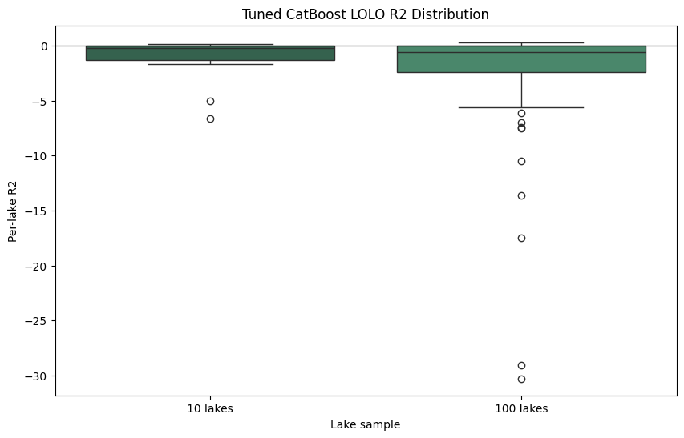

# Experiment 35: Tuned CatBoost Leave-One-Lake-Out Evaluation

## What We Did (Methodology)

We fixed the tuned CatBoost parameters from Experiment 34 and used them for two leave-one-lake-out tests after excluding CHLA from the chemistry inputs. The first repeated the exact 10 seeded comparison lakes used earlier in the boosting experiments. The second evaluated a reproducible random 100-lake sample drawn with seed 42 from lakes with at least 20 valid observations so every run yields the same lake set and comparable average R².

## Fixed Model Configuration

Tuned CatBoost parameters from Experiment 34: {'iterations': 700, 'depth': 10, 'learning_rate': 0.05, 'l2_leaf_reg': 3, 'random_seed': 42, 'loss_function': 'RMSE', 'eval_metric': 'RMSE', 'verbose': False, 'allow_writing_files': False, 'thread_count': -1}

Feature set (CHLA excluded): ['year', 'month', 'LATITUDE', 'LONGITUDE', 'AREA_ACRES', 'DEPTH_MAX_FEET', 'DOMAX', 'DOMIN', 'TPEC', 'TPBG', 'PH', 'COLOR', 'CONDUCT', 'ALK']

Seeded 10-lake file: `lolo_random_seed_10.txt`
Seeded 100-lake file: `lolo_random_seed_100_seed42.txt`

## LOLO Summary Results

| Lake Sample | n_lakes_evaluated | avg_R2 | median_R2 | avg_MAE |
| --- | --- | --- | --- | --- |
| Seeded comparison set (10 lakes) | 10 | -1.381 | -0.192 | 1.221 |
| Random sample (100 lakes, seed=42) | 100 | -2.244 | -0.582 | 1.114 |

## Seeded 10-Lake Results

| MIDAS | pct_missing_overall | n_obs | R2 | MAE | MAE_Norm |
| --- | --- | --- | --- | --- | --- |
| c0157 | 0.952 | 117 | -6.596 | 0.526 | 0.031 |
| c3420 | 0.606 | 610 | -1.68 | 1.259 | 0.018 |
| c3814 | 0.596 | 1073 | -0.131 | 1.704 | 0.061 |
| c3180 | 0.91 | 80 | 0.006 | 0.851 | 0.02 |
| c0224 | 0.968 | 390 | -4.988 | 4.76 | 0.024 |
| c3448 | 0.399 | 427 | -0.241 | 0.866 | 0.018 |
| c5242 | 0.664 | 451 | 0.15 | 0.582 | 0.021 |
| c3712 | 0.71 | 579 | 0.058 | 0.543 | 0.014 |
| c2222 | 0.91 | 80 | -0.185 | 0.557 | 0.029 |
| c3132 | 0.608 | 628 | -0.198 | 0.56 | 0.01 |

**Average LOLO R² (10 lakes):** -1.3806

## Random 100-Lake Results

Top 15 lakes by LOLO R²:

| MIDAS | pct_missing_overall | n_obs | R2 | MAE | MAE_Norm |
| --- | --- | --- | --- | --- | --- |
| c4284 | 0.928 | 200 | 0.315 | 0.876 | 0.018 |
| c3608 | 0.976 | 474 | 0.313 | 0.792 | 0.019 |
| c3418 | 0.594 | 642 | 0.235 | 0.813 | 0.019 |
| c3898 | 0.966 | 339 | 0.227 | 0.625 | 0.014 |
| c5368 | 0.552 | 250 | 0.182 | 0.775 | 0.024 |
| c4857 | 0.962 | 258 | 0.175 | 0.456 | 0.015 |
| c3920 | 0.816 | 461 | 0.172 | 0.655 | 0.015 |
| c5268 | 0.971 | 101 | 0.163 | 0.693 | 0.041 |
| c5312 | 0.824 | 1148 | 0.129 | 0.93 | 0.007 |
| c4318 | 0.597 | 22 | 0.127 | 0.952 | 0.038 |
| c4622 | 0.764 | 365 | 0.108 | 1.25 | 0.011 |
| c5706 | 0.682 | 98 | 0.106 | 1.629 | 0.034 |
| c0324 | 1.0 | 21 | 0.104 | 0.938 | 0.014 |
| c1680 | 0.955 | 164 | 0.086 | 0.608 | 0.03 |
| c3434 | 0.695 | 564 | 0.081 | 0.702 | 0.015 |

Bottom 15 lakes by LOLO R²:

| MIDAS | pct_missing_overall | n_obs | R2 | MAE | MAE_Norm |
| --- | --- | --- | --- | --- | --- |
| c5034 | 0.94 | 74 | -30.29 | 1.922 | 0.087 |
| c4344 | 0.973 | 390 | -29.037 | 3.281 | 0.038 |
| c5016 | 0.861 | 34 | -17.472 | 2.546 | 0.039 |
| c2202 | 0.857 | 50 | -13.598 | 2.487 | 0.039 |
| c3520 | 0.977 | 502 | -10.504 | 2.511 | 0.021 |
| c3178 | 0.928 | 145 | -7.492 | 1.525 | 0.073 |
| c4434 | 0.943 | 162 | -7.406 | 3.792 | 0.017 |
| c4412 | 0.951 | 132 | -6.99 | 2.354 | 0.02 |
| c0410 | 0.978 | 105 | -6.09 | 1.988 | 0.031 |
| c1088 | 0.176 | 107 | -5.574 | 2.263 | 0.036 |
| c4722 | 0.991 | 74 | -5.048 | 0.755 | 0.054 |
| c5490 | 0.977 | 240 | -4.968 | 1.502 | 0.06 |
| c3140 | 0.494 | 177 | -4.9 | 1.344 | 0.05 |
| c0159 | 0.938 | 30 | -4.709 | 2.063 | 0.057 |
| c3980 | 0.777 | 153 | -4.511 | 1.753 | 0.041 |

**Average LOLO R² (100 lakes, seed=42):** -2.2441
