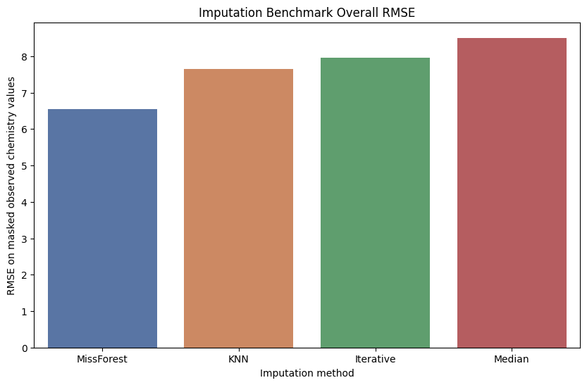
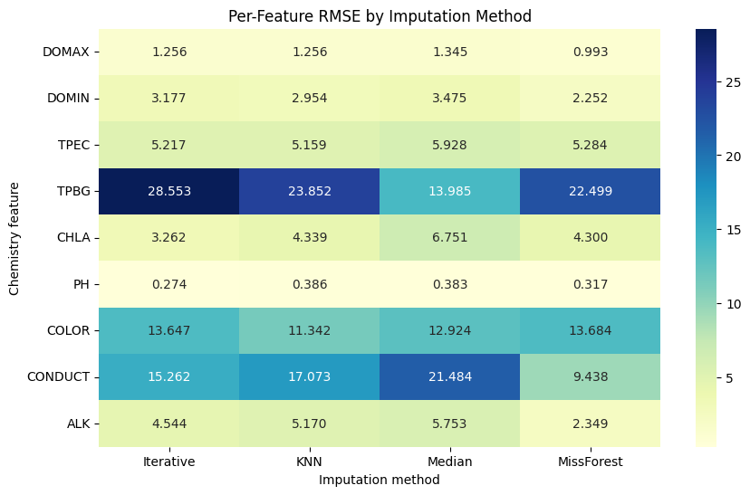

# Experiment 36: Numerical Chemistry Imputation Benchmark

## Objective

Benchmark numerical chemistry imputers before pairing any of them with the final Secchi prediction model. This experiment focuses only on how well each method reconstructs masked observed chemistry values.

## Method

Use a chronological 80/20 split on rows with valid temporal and geographic base features, then cap the benchmark to a reproducible sample of 6,000 training rows and 2,000 test rows for runtime control. Randomly mask 20% of originally observed values in each chemistry feature on the test slice using seed 42. Fit each imputer on the training slice only, transform the masked test slice, and compare imputed values against the true hidden values.

## Parameters

Chemistry features benchmarked (CHLA included for imputation-only evaluation): ['DOMAX', 'DOMIN', 'TPEC', 'TPBG', 'CHLA', 'PH', 'COLOR', 'CONDUCT', 'ALK']

Imputation methods:
- `Median`: `SimpleImputer(strategy='median')`
- `KNN`: `KNNImputer(n_neighbors=5, weights='distance')`
- `Iterative`: `IterativeImputer(estimator=BayesianRidge(), max_iter=10, random_state=42)`
- `MissForest`: `IterativeImputer(estimator=RandomForestRegressor(n_estimators=30, max_depth=10, random_state=42, n_jobs=-1), max_iter=3, random_state=42)`

Feature columns supplied to imputers: ['year', 'month', 'LATITUDE', 'LONGITUDE', 'AREA_ACRES', 'DEPTH_MAX_FEET', 'DOMAX', 'DOMIN', 'TPEC', 'TPBG', 'CHLA', 'PH', 'COLOR', 'CONDUCT', 'ALK']

## Results

### Overall Reconstruction Ranking

| method | feature | n_masked | mae | rmse | norm_mae |
| --- | --- | --- | --- | --- | --- |
| MissForest | Overall | 721 | 3.175 | 6.55 | 0.29 |
| KNN | Overall | 721 | 3.591 | 7.642 | 0.328 |
| Iterative | Overall | 721 | 4.173 | 7.951 | 0.382 |
| Median | Overall | 721 | 4.22 | 8.505 | 0.386 |

### Per-Feature Reconstruction Metrics

| method | feature | n_masked | mae | rmse | norm_mae |
| --- | --- | --- | --- | --- | --- |
| Median | DOMAX | 136 | 0.985 | 1.345 | 0.106 |
| Median | DOMIN | 136 | 2.983 | 3.475 | 0.902 |
| Median | TPEC | 88 | 4.091 | 5.928 | 0.424 |
| Median | TPBG | 17 | 9.676 | 13.985 | 0.458 |
| Median | CHLA | 90 | 2.751 | 6.751 | 0.562 |
| Median | PH | 59 | 0.258 | 0.384 | 0.037 |
| Median | COLOR | 63 | 9.96 | 12.924 | 0.454 |
| Median | CONDUCT | 58 | 13.79 | 21.484 | 0.403 |
| Median | ALK | 74 | 3.892 | 5.753 | 0.384 |
| KNN | DOMAX | 136 | 0.901 | 1.256 | 0.097 |
| KNN | DOMIN | 136 | 2.37 | 2.954 | 0.716 |
| KNN | TPEC | 88 | 3.37 | 5.159 | 0.349 |
| KNN | TPBG | 17 | 15.257 | 23.852 | 0.722 |
| KNN | CHLA | 90 | 2.232 | 4.339 | 0.456 |
| KNN | PH | 59 | 0.268 | 0.386 | 0.039 |
| KNN | COLOR | 63 | 8.454 | 11.342 | 0.386 |
| KNN | CONDUCT | 58 | 10.513 | 17.073 | 0.307 |
| KNN | ALK | 74 | 3.104 | 5.17 | 0.306 |
| Iterative | DOMAX | 136 | 0.906 | 1.256 | 0.098 |
| Iterative | DOMIN | 136 | 2.529 | 3.177 | 0.764 |
| Iterative | TPEC | 88 | 3.569 | 5.217 | 0.37 |
| Iterative | TPBG | 17 | 22.18 | 28.553 | 1.049 |
| Iterative | CHLA | 90 | 2.502 | 3.262 | 0.511 |
| Iterative | PH | 59 | 0.195 | 0.274 | 0.028 |
| Iterative | COLOR | 63 | 10.917 | 13.647 | 0.498 |
| Iterative | CONDUCT | 58 | 11.588 | 15.262 | 0.339 |
| Iterative | ALK | 74 | 3.432 | 4.544 | 0.338 |
| MissForest | DOMAX | 136 | 0.691 | 0.993 | 0.075 |
| MissForest | DOMIN | 136 | 1.714 | 2.252 | 0.518 |
| MissForest | TPEC | 88 | 3.271 | 5.284 | 0.339 |
| MissForest | TPBG | 17 | 16.125 | 22.499 | 0.762 |
| MissForest | CHLA | 90 | 2.426 | 4.3 | 0.496 |
| MissForest | PH | 59 | 0.217 | 0.317 | 0.031 |
| MissForest | COLOR | 63 | 10.2 | 13.684 | 0.465 |
| MissForest | CONDUCT | 58 | 6.743 | 9.438 | 0.197 |
| MissForest | ALK | 74 | 1.825 | 2.349 | 0.18 |

## Next Step

Carry the leading imputation method(s), currently `MissForest`, into a downstream CatBoost comparison against the native-missing baseline. The CatBoost experiment should still exclude CHLA from the Secchi prediction feature set even though CHLA was allowed here for imputation evaluation.
