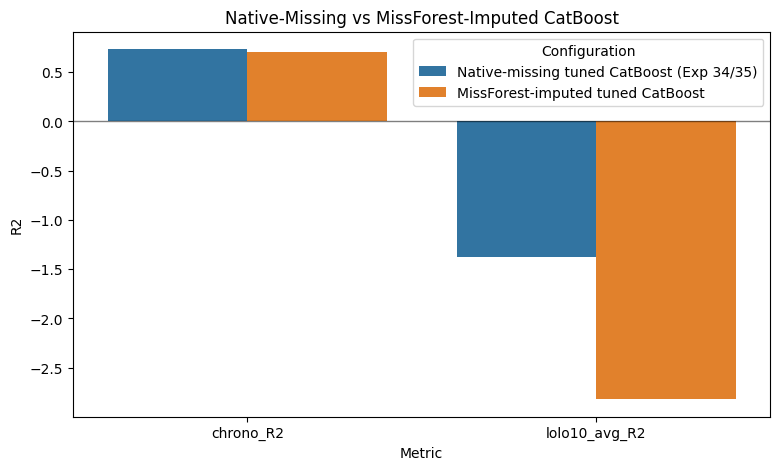
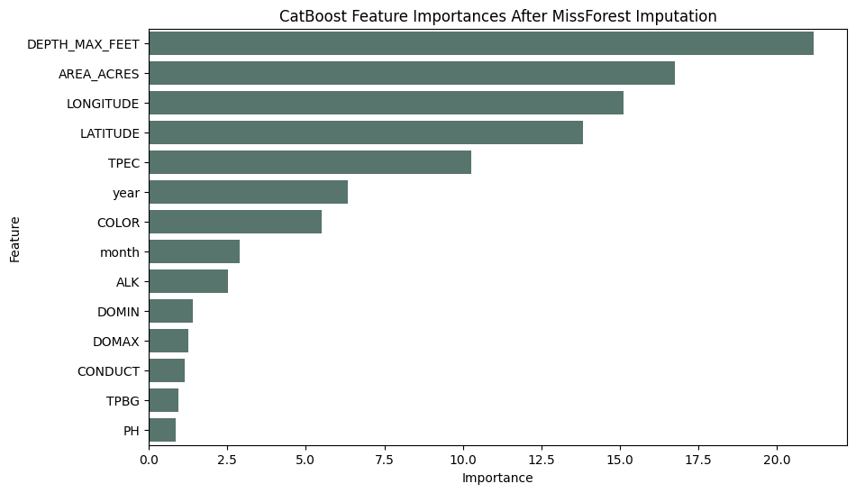

# Experiment 37: Tuned CatBoost with MissForest Imputation

## Objective

Test whether the best imputer from Experiment 36 improves tuned CatBoost relative to the native-missing baseline. The comparison stays on the no-CHLA Secchi prediction feature set so the final-model policy is unchanged.

## Method

Use the tuned CatBoost parameters from Experiment 34 with the no-CHLA chemistry set. For each split, fit MissForest-style imputation on the training features only, transform training and test features separately, and then train CatBoost on the imputed values. Evaluate once on the chronological 80/20 split and once on the seeded 10-lake LOLO set so the result can be compared directly against Experiments 34 and 35.

## Parameters

CatBoost parameters: {'iterations': 700, 'depth': 10, 'learning_rate': 0.05, 'l2_leaf_reg': 3, 'random_seed': 42, 'loss_function': 'RMSE', 'eval_metric': 'RMSE', 'verbose': False, 'allow_writing_files': False, 'thread_count': -1}

MissForest-style imputer: {'n_estimators': 30, 'max_depth': 10, 'random_state': 42, 'n_jobs': -1, 'max_iter': 3}

Feature set (CHLA excluded): ['year', 'month', 'LATITUDE', 'LONGITUDE', 'AREA_ACRES', 'DEPTH_MAX_FEET', 'DOMAX', 'DOMIN', 'TPEC', 'TPBG', 'PH', 'COLOR', 'CONDUCT', 'ALK']

LOLO seed file: `lolo_random_seed_10.txt`

## Results

### Baseline Comparison

| Configuration | chrono_R2 | chrono_MAE | chrono_RMSE | lolo10_avg_R2 | lolo10_avg_MAE |
| --- | --- | --- | --- | --- | --- |
| Native-missing tuned CatBoost (Exp 34/35) | 0.732 | 0.812 | 1.09 | -1.381 | 1.221 |
| MissForest-imputed tuned CatBoost | 0.705 | 0.852 | 1.144 | -2.819 | 1.27 |

### Chronological Imputed CatBoost Importances

| Feature | Importance |
| --- | --- |
| DEPTH_MAX_FEET | 21.168 |
| AREA_ACRES | 16.738 |
| LONGITUDE | 15.114 |
| LATITUDE | 13.824 |
| TPEC | 10.279 |
| year | 6.337 |
| COLOR | 5.503 |
| month | 2.898 |
| ALK | 2.529 |
| DOMIN | 1.398 |
| DOMAX | 1.268 |
| CONDUCT | 1.155 |
| TPBG | 0.939 |
| PH | 0.851 |

### Seeded 10-Lake LOLO Results

| MIDAS | pct_missing_overall | n_obs | R2 | MAE | MAE_Norm |
| --- | --- | --- | --- | --- | --- |
| c0157 | 0.952 | 117 | -20.246 | 0.84 | 0.049 |
| c3420 | 0.606 | 610 | -2.163 | 1.355 | 0.019 |
| c3814 | 0.596 | 1073 | -0.103 | 1.673 | 0.06 |
| c3180 | 0.91 | 80 | 0.084 | 0.811 | 0.019 |
| c0224 | 0.968 | 390 | -5.324 | 4.898 | 0.025 |
| c3448 | 0.399 | 427 | -0.15 | 0.819 | 0.017 |
| c5242 | 0.664 | 451 | 0.128 | 0.595 | 0.021 |
| c3712 | 0.71 | 579 | -0.22 | 0.654 | 0.017 |
| c2222 | 0.91 | 80 | 0.008 | 0.49 | 0.026 |
| c3132 | 0.608 | 628 | -0.206 | 0.566 | 0.01 |

**Average LOLO R² (10 lakes):** -2.8193

## Next Step

If MissForest-imputed CatBoost improves LOLO enough to justify the extra preprocessing cost, extend the comparison to the 100-lake seeded sample. Otherwise keep the native-missing CatBoost path as the preferred simpler model.
