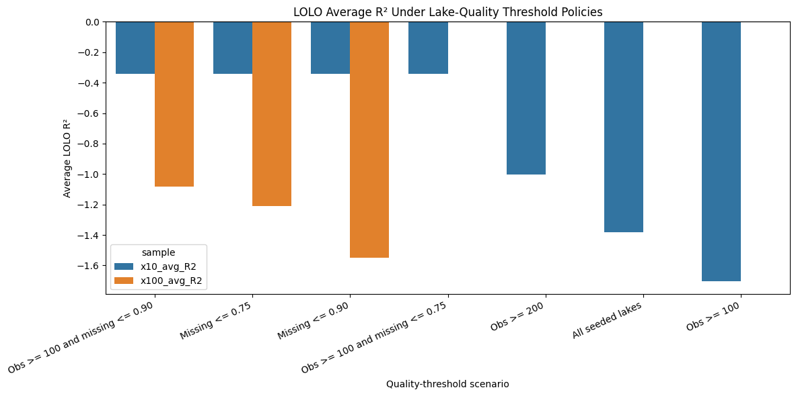

# Experiment 38: LOLO Quality Thresholds for Tuned CatBoost

## Objective

Test whether tuned native-missing CatBoost becomes materially more stable under LOLO when evaluation is restricted to higher-quality lakes. The goal is to identify whether observation count and chemistry missingness thresholds define a more trustworthy deployment region.

## Method

Use the tuned no-CHLA CatBoost model from Experiments 34 and 35. For each quality-threshold scenario, filter the fixed seeded 10-lake and seeded 100-lake LOLO sample files down to lakes that satisfy the required minimum observation count and maximum chemistry missingness. Screen all scenarios on the seeded 10-lake set first, then run the more expensive 100-lake confirmation only for the strongest scenarios by 10-lake average R² so the experiment stays rerunnable.

## Parameters

Tuned CatBoost parameters: {'iterations': 700, 'depth': 10, 'learning_rate': 0.05, 'l2_leaf_reg': 3, 'random_seed': 42, 'loss_function': 'RMSE', 'eval_metric': 'RMSE', 'verbose': False, 'allow_writing_files': False, 'thread_count': -1}

Feature set (CHLA excluded): ['year', 'month', 'LATITUDE', 'LONGITUDE', 'AREA_ACRES', 'DEPTH_MAX_FEET', 'DOMAX', 'DOMIN', 'TPEC', 'TPBG', 'PH', 'COLOR', 'CONDUCT', 'ALK']

Quality-threshold scenarios: [{'label': 'All seeded lakes', 'min_obs': 0, 'max_missing': 1.0}, {'label': 'Obs >= 100', 'min_obs': 100, 'max_missing': 1.0}, {'label': 'Obs >= 200', 'min_obs': 200, 'max_missing': 1.0}, {'label': 'Missing <= 0.90', 'min_obs': 0, 'max_missing': 0.9}, {'label': 'Missing <= 0.75', 'min_obs': 0, 'max_missing': 0.75}, {'label': 'Obs >= 100 and missing <= 0.90', 'min_obs': 100, 'max_missing': 0.9}, {'label': 'Obs >= 100 and missing <= 0.75', 'min_obs': 100, 'max_missing': 0.75}]

Observation counts were computed from the full modeling frame after target/date/base-feature filtering. Lake missingness came from `data/lake_missingness.csv`. Top 100-lake confirmations run: 3.

## Results

### Scenario Summary

| scenario | min_obs | max_missing | x10_lakes_retained | x10_avg_R2 | x10_median_R2 | x10_avg_MAE | x100_lakes_retained | x100_avg_R2 | x100_median_R2 | x100_avg_MAE | x100_confirmed |
| --- | --- | --- | --- | --- | --- | --- | --- | --- | --- | --- | --- |
| Obs >= 100 and missing <= 0.90 | 100 | 0.9 | 6 | -0.34 | -0.164 | 0.919 | 34 | -1.084 | -0.474 | 1.047 | True |
| Missing <= 0.75 | 0 | 0.75 | 6 | -0.34 | -0.164 | 0.919 | 34 | -1.21 | -0.643 | 1.046 | True |
| Missing <= 0.90 | 0 | 0.9 | 6 | -0.34 | -0.164 | 0.919 | 58 | -1.55 | -0.475 | 1.053 | True |
| Obs >= 100 and missing <= 0.75 | 100 | 0.75 | 6 | -0.34 | -0.164 | 0.919 | 22 |  |  |  | False |
| Obs >= 200 | 200 | 1.0 | 7 | -1.004 | -0.198 | 1.468 | 46 |  |  |  | False |
| All seeded lakes | 0 | 1.0 | 10 | -1.381 | -0.192 | 1.221 | 100 |  |  |  | False |
| Obs >= 100 | 100 | 1.0 | 8 | -1.703 | -0.22 | 1.35 | 62 |  |  |  | False |

### All seeded lakes

Qualified lakes retained in seeded 10-lake sample: 10

| MIDAS | pct_missing_overall | n_obs | R2 | MAE | MAE_Norm |
| --- | --- | --- | --- | --- | --- |
| c0157 | 0.952 | 117 | -6.596 | 0.526 | 0.031 |
| c3420 | 0.606 | 610 | -1.68 | 1.259 | 0.018 |
| c3814 | 0.596 | 1073 | -0.131 | 1.704 | 0.061 |
| c3180 | 0.91 | 80 | 0.006 | 0.851 | 0.02 |
| c0224 | 0.968 | 390 | -4.988 | 4.76 | 0.024 |
| c3448 | 0.399 | 427 | -0.241 | 0.866 | 0.018 |
| c5242 | 0.664 | 451 | 0.15 | 0.582 | 0.021 |
| c3712 | 0.71 | 579 | 0.058 | 0.543 | 0.014 |
| c2222 | 0.91 | 80 | -0.185 | 0.557 | 0.029 |
| c3132 | 0.608 | 628 | -0.198 | 0.56 | 0.01 |

Qualified lakes retained in seeded 100-lake sample: 100

100-lake confirmation executed: No

Top 10 of retained 100-lake results by R²:

_(not run in 100-lake confirmation stage)_

### Obs >= 100

Qualified lakes retained in seeded 10-lake sample: 8

| MIDAS | pct_missing_overall | n_obs | R2 | MAE | MAE_Norm |
| --- | --- | --- | --- | --- | --- |
| c0157 | 0.952 | 117 | -6.596 | 0.526 | 0.031 |
| c3420 | 0.606 | 610 | -1.68 | 1.259 | 0.018 |
| c3814 | 0.596 | 1073 | -0.131 | 1.704 | 0.061 |
| c0224 | 0.968 | 390 | -4.988 | 4.76 | 0.024 |
| c3448 | 0.399 | 427 | -0.241 | 0.866 | 0.018 |
| c5242 | 0.664 | 451 | 0.15 | 0.582 | 0.021 |
| c3712 | 0.71 | 579 | 0.058 | 0.543 | 0.014 |
| c3132 | 0.608 | 628 | -0.198 | 0.56 | 0.01 |

Qualified lakes retained in seeded 100-lake sample: 62

100-lake confirmation executed: No

Top 10 of retained 100-lake results by R²:

_(not run in 100-lake confirmation stage)_

### Obs >= 200

Qualified lakes retained in seeded 10-lake sample: 7

| MIDAS | pct_missing_overall | n_obs | R2 | MAE | MAE_Norm |
| --- | --- | --- | --- | --- | --- |
| c3420 | 0.606 | 610 | -1.68 | 1.259 | 0.018 |
| c3814 | 0.596 | 1073 | -0.131 | 1.704 | 0.061 |
| c0224 | 0.968 | 390 | -4.988 | 4.76 | 0.024 |
| c3448 | 0.399 | 427 | -0.241 | 0.866 | 0.018 |
| c5242 | 0.664 | 451 | 0.15 | 0.582 | 0.021 |
| c3712 | 0.71 | 579 | 0.058 | 0.543 | 0.014 |
| c3132 | 0.608 | 628 | -0.198 | 0.56 | 0.01 |

Qualified lakes retained in seeded 100-lake sample: 46

100-lake confirmation executed: No

Top 10 of retained 100-lake results by R²:

_(not run in 100-lake confirmation stage)_

### Missing <= 0.90

Qualified lakes retained in seeded 10-lake sample: 6

| MIDAS | pct_missing_overall | n_obs | R2 | MAE | MAE_Norm |
| --- | --- | --- | --- | --- | --- |
| c3420 | 0.606 | 610 | -1.68 | 1.259 | 0.018 |
| c3814 | 0.596 | 1073 | -0.131 | 1.704 | 0.061 |
| c3448 | 0.399 | 427 | -0.241 | 0.866 | 0.018 |
| c5242 | 0.664 | 451 | 0.15 | 0.582 | 0.021 |
| c3712 | 0.71 | 579 | 0.058 | 0.543 | 0.014 |
| c3132 | 0.608 | 628 | -0.198 | 0.56 | 0.01 |

Qualified lakes retained in seeded 100-lake sample: 58

100-lake confirmation executed: Yes

Top 10 of retained 100-lake results by R²:

| MIDAS | pct_missing_overall | n_obs | R2 | MAE | MAE_Norm |
| --- | --- | --- | --- | --- | --- |
| c3418 | 0.594 | 642 | 0.235 | 0.813 | 0.019 |
| c5368 | 0.552 | 250 | 0.182 | 0.775 | 0.024 |
| c3920 | 0.816 | 461 | 0.172 | 0.655 | 0.015 |
| c5312 | 0.824 | 1148 | 0.129 | 0.93 | 0.007 |
| c4318 | 0.597 | 22 | 0.127 | 0.952 | 0.038 |
| c4622 | 0.764 | 365 | 0.108 | 1.25 | 0.011 |
| c5706 | 0.682 | 98 | 0.106 | 1.629 | 0.034 |
| c3434 | 0.695 | 564 | 0.081 | 0.702 | 0.015 |
| c5666 | 0.891 | 524 | 0.077 | 0.676 | 0.018 |
| c4736 | 0.612 | 109 | 0.063 | 0.371 | 0.019 |

## Next Step

The current best scenario by 100-lake average R² is `Obs >= 100 and missing <= 0.90`. Use this result to decide whether the dashboard should expose predictions for all lakes or only for a higher-quality subset with stronger historical support.
