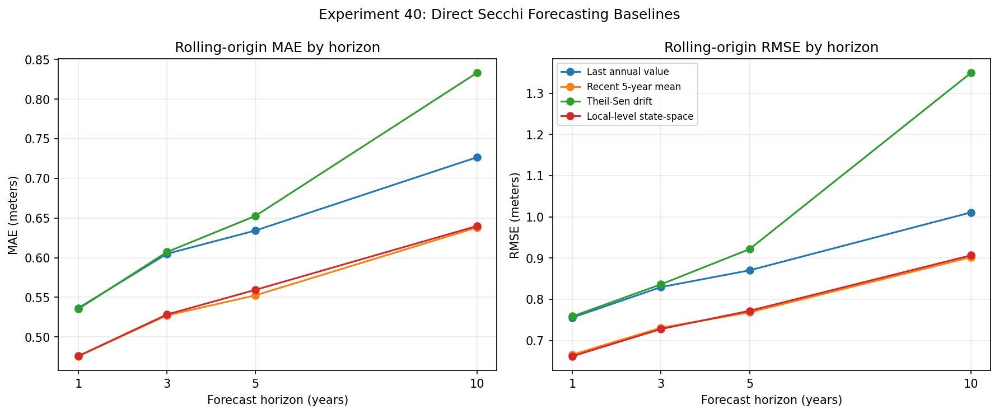

# Experiment 40: Direct Secchi Forecasting Baselines

## Objective

Benchmark direct annual summer Secchi forecasting baselines before fitting the hierarchical state-space and global multi-horizon CatBoost candidates. The experiment tests whether simple persistence, recent-level, robust-drift, or local-level dynamics provide useful forecasts at horizons 1, 3, 5, and 10 years.

## Method

Use the persisted station-balanced annual summer lake-year target from Experiment 39. For each calendar origin from 2005 through 2014, remove all lake-years after the origin, fit each method using only the remaining history, and evaluate against the exact subsequently observed summer target at each requested horizon. The common comparison cohort requires at least two prior summer lake-years and at least one observation in the preceding five calendar years.

## Parameters

Dataset ID: `secchi-merged-2026-06-29-r1`.

Annual target: station-balanced June–September Secchi depth in meters.

Origins: `2005–2014`. Horizons: `(1, 3, 5, 10)`.

Baselines:
- `Last annual value`: latest observed lake-year target.
- `Recent 5-year mean`: mean of observed lake-years in the latest five calendar years.
- `Theil-Sen drift`: robust slope/intercept fit to all prior lake-year targets, extrapolated to the forecast year and clipped at zero.
- `Local-level state-space`: per-lake random-walk latent level fit by maximum likelihood with a Kalman filter; calendar gaps increase process variance.

Metrics: MAE, RMSE, mean bias (prediction minus observation), MASE scaled by the in-history mean absolute change between successive observed annual values (calendar gaps are not interpolated), and percentage of lake forecasts beating the last-value naive baseline.

## Results

### Rolling-Origin Coverage

| horizon | n_forecast_cases | n_lakes | n_origins | first_origin | last_origin |
| --- | --- | --- | --- | --- | --- |
| 1 | 3398 | 495 | 10 | 2005 | 2014 |
| 3 | 3293 | 459 | 10 | 2005 | 2014 |
| 5 | 3208 | 447 | 10 | 2005 | 2014 |
| 10 | 3020 | 421 | 10 | 2005 | 2014 |

### Accuracy by Model and Horizon

| model | horizon | n_forecasts | n_lakes | n_origins | MAE | RMSE | mean_bias | MASE | pct_lakes_beat_naive |
| --- | --- | --- | --- | --- | --- | --- | --- | --- | --- |
| Recent 5-year mean | 1 | 3398 | 495 | 10 | 0.4757 | 0.6656 | 0.0089 | 0.8825 | 62.4242 |
| Local-level state-space | 1 | 3398 | 495 | 10 | 0.4759 | 0.6618 | -0.0065 | 0.8834 | 68.4848 |
| Theil-Sen drift | 1 | 3398 | 495 | 10 | 0.5354 | 0.7586 | 0.1157 | 0.9819 | 52.5253 |
| Last annual value | 1 | 3398 | 495 | 10 | 0.5365 | 0.7557 | -0.0406 | 0.985 |  |
| Recent 5-year mean | 3 | 3293 | 459 | 10 | 0.5272 | 0.7309 | -0.0757 | 0.9861 | 65.3595 |
| Local-level state-space | 3 | 3293 | 459 | 10 | 0.5284 | 0.7278 | -0.0863 | 0.9886 | 72.7669 |
| Last annual value | 3 | 3293 | 459 | 10 | 0.6049 | 0.8296 | -0.1272 | 1.1079 |  |
| Theil-Sen drift | 3 | 3293 | 459 | 10 | 0.6071 | 0.8363 | 0.052 | 1.1315 | 50.7625 |
| Recent 5-year mean | 5 | 3208 | 447 | 10 | 0.5525 | 0.7681 | -0.1416 | 1.0307 | 66.8904 |
| Local-level state-space | 5 | 3208 | 447 | 10 | 0.5594 | 0.7721 | -0.1572 | 1.0488 | 75.1678 |
| Last annual value | 5 | 3208 | 447 | 10 | 0.6342 | 0.8703 | -0.1999 | 1.1618 |  |
| Theil-Sen drift | 5 | 3208 | 447 | 10 | 0.6527 | 0.9217 | 0.0145 | 1.2237 | 50.5593 |
| Recent 5-year mean | 10 | 3020 | 421 | 10 | 0.638 | 0.9021 | -0.1773 | 1.1752 | 68.8836 |
| Local-level state-space | 10 | 3020 | 421 | 10 | 0.6399 | 0.9066 | -0.1939 | 1.1932 | 71.734 |
| Last annual value | 10 | 3020 | 421 | 10 | 0.7266 | 1.0107 | -0.2301 | 1.3284 |  |
| Theil-Sen drift | 10 | 3020 | 421 | 10 | 0.833 | 1.3493 | 0.0567 | 1.5335 | 46.3183 |

### Target Sensitivity on a Common Eligible Cohort

Each row uses the recent 5-year calendar mean fitted from that target's own history. Eligibility is intersected across all four targets at each origin, horizon, and lake; full-year month effects are re-estimated and frozen at each origin.

| horizon | target | n_cases | n_lakes | MAE | MASE |
| --- | --- | --- | --- | --- | --- |
| 1 | Canonical summer station-balanced mean | 3398 | 495 | 0.4757 | 0.8825 |
| 1 | Full-year seasonally adjusted mean | 3398 | 495 | 0.4548 | 0.8854 |
| 1 | Summer date-balanced/reading-weighted mean | 3398 | 495 | 0.4708 | 0.8805 |
| 1 | Summer station-year median of daily-duplicate means | 3398 | 495 | 0.5047 | 0.8772 |
| 3 | Canonical summer station-balanced mean | 3293 | 459 | 0.5272 | 0.9861 |
| 3 | Full-year seasonally adjusted mean | 3293 | 459 | 0.5084 | 0.9884 |
| 3 | Summer date-balanced/reading-weighted mean | 3293 | 459 | 0.5237 | 0.9856 |
| 3 | Summer station-year median of daily-duplicate means | 3293 | 459 | 0.554 | 0.9821 |
| 5 | Canonical summer station-balanced mean | 3208 | 447 | 0.5525 | 1.0307 |
| 5 | Full-year seasonally adjusted mean | 3208 | 447 | 0.5373 | 1.0414 |
| 5 | Summer date-balanced/reading-weighted mean | 3208 | 447 | 0.5528 | 1.0363 |
| 5 | Summer station-year median of daily-duplicate means | 3208 | 447 | 0.5772 | 1.0159 |
| 10 | Canonical summer station-balanced mean | 3020 | 421 | 0.638 | 1.1752 |
| 10 | Full-year seasonally adjusted mean | 3020 | 421 | 0.626 | 1.1609 |
| 10 | Summer date-balanced/reading-weighted mean | 3020 | 421 | 0.6374 | 1.1822 |
| 10 | Summer station-year median of daily-duplicate means | 3020 | 421 | 0.6661 | 1.1541 |

### History-Stratified Accuracy

| model | horizon | history_bin | n_forecasts | n_lakes | n_origins | MAE | RMSE | mean_bias | MASE | pct_lakes_beat_naive |
| --- | --- | --- | --- | --- | --- | --- | --- | --- | --- | --- |
| Last annual value | 1 | 10–14 years | 394 | 126 | 10 | 0.4726 | 0.6615 | -0.0225 | 0.8908 |  |
| Last annual value | 1 | 15+ years | 2424 | 306 | 10 | 0.5501 | 0.7609 | -0.0452 | 0.9623 |  |
| Last annual value | 1 | 2–4 years | 212 | 116 | 10 | 0.5669 | 0.8686 | -0.0783 | 1.5542 |  |
| Last annual value | 1 | 5–9 years | 368 | 135 | 10 | 0.4974 | 0.7458 | -0.0078 | 0.9096 |  |
| Local-level state-space | 1 | 10–14 years | 394 | 126 | 10 | 0.4132 | 0.5671 | 0.0081 | 0.7844 | 62.6984 |
| Local-level state-space | 1 | 15+ years | 2424 | 306 | 10 | 0.4807 | 0.6601 | 0.0006 | 0.8461 | 76.1438 |
| Local-level state-space | 1 | 2–4 years | 212 | 116 | 10 | 0.5513 | 0.8201 | -0.1218 | 1.4954 | 53.4483 |
| Local-level state-space | 1 | 5–9 years | 368 | 135 | 10 | 0.4682 | 0.665 | -0.0028 | 0.8844 | 55.5556 |
| Recent 5-year mean | 1 | 10–14 years | 394 | 126 | 10 | 0.4299 | 0.5896 | 0.0074 | 0.8109 | 56.3492 |
| Recent 5-year mean | 1 | 15+ years | 2424 | 306 | 10 | 0.482 | 0.665 | 0.0211 | 0.8401 | 70.915 |
| Recent 5-year mean | 1 | 2–4 years | 212 | 116 | 10 | 0.5107 | 0.778 | -0.1095 | 1.4765 | 43.1034 |
| Recent 5-year mean | 1 | 5–9 years | 368 | 135 | 10 | 0.4631 | 0.6766 | -0.0014 | 0.898 | 48.8889 |
| Theil-Sen drift | 1 | 10–14 years | 394 | 126 | 10 | 0.4511 | 0.6074 | 0.0755 | 0.8624 | 56.3492 |
| Theil-Sen drift | 1 | 15+ years | 2424 | 306 | 10 | 0.5359 | 0.7288 | 0.1386 | 0.933 | 59.4771 |
| Theil-Sen drift | 1 | 2–4 years | 212 | 116 | 10 | 0.721 | 1.2109 | 0.0112 | 1.7933 | 30.1724 |
| Theil-Sen drift | 1 | 5–9 years | 368 | 135 | 10 | 0.515 | 0.7584 | 0.068 | 0.9669 | 44.4444 |
| Last annual value | 3 | 10–14 years | 394 | 121 | 10 | 0.5535 | 0.777 | -0.0915 | 0.9919 |  |
| Last annual value | 3 | 15+ years | 2371 | 302 | 10 | 0.6187 | 0.8402 | -0.1276 | 1.0789 |  |
| Last annual value | 3 | 2–4 years | 169 | 86 | 10 | 0.6085 | 0.8821 | -0.2028 | 2.0114 |  |
| Last annual value | 3 | 5–9 years | 359 | 126 | 10 | 0.5684 | 0.7882 | -0.1281 | 1.0043 |  |
| Local-level state-space | 3 | 10–14 years | 394 | 121 | 10 | 0.4899 | 0.6969 | -0.0561 | 0.8853 | 61.9835 |
| Local-level state-space | 3 | 15+ years | 2371 | 302 | 10 | 0.5336 | 0.7284 | -0.08 | 0.9415 | 79.1391 |
| Local-level state-space | 3 | 2–4 years | 169 | 86 | 10 | 0.5607 | 0.8197 | -0.2099 | 1.9389 | 53.4884 |
| Local-level state-space | 3 | 5–9 years | 359 | 126 | 10 | 0.5203 | 0.7109 | -0.1023 | 0.9687 | 50.7937 |
| Recent 5-year mean | 3 | 10–14 years | 394 | 121 | 10 | 0.4919 | 0.7083 | -0.0579 | 0.9153 | 52.0661 |
| Recent 5-year mean | 3 | 15+ years | 2371 | 302 | 10 | 0.5334 | 0.731 | -0.0617 | 0.9301 | 73.8411 |
| Recent 5-year mean | 3 | 2–4 years | 169 | 86 | 10 | 0.5726 | 0.8569 | -0.2379 | 1.9504 | 40.6977 |
| Recent 5-year mean | 3 | 5–9 years | 359 | 126 | 10 | 0.5035 | 0.6891 | -0.1112 | 0.9829 | 52.381 |
| Theil-Sen drift | 3 | 10–14 years | 394 | 121 | 10 | 0.5685 | 0.7766 | 0.0378 | 1.0617 | 44.6281 |
| Theil-Sen drift | 3 | 15+ years | 2371 | 302 | 10 | 0.5897 | 0.7968 | 0.0786 | 1.031 | 58.6093 |
| Theil-Sen drift | 3 | 2–4 years | 169 | 86 | 10 | 0.8862 | 1.3224 | -0.1739 | 2.6473 | 32.5581 |
| Theil-Sen drift | 3 | 5–9 years | 359 | 126 | 10 | 0.6334 | 0.8584 | -0.0017 | 1.163 | 37.3016 |
| Last annual value | 5 | 10–14 years | 378 | 114 | 10 | 0.6029 | 0.8447 | -0.0908 | 1.0862 |  |
| Last annual value | 5 | 15+ years | 2345 | 298 | 10 | 0.645 | 0.8781 | -0.2166 | 1.1114 |  |
| Last annual value | 5 | 2–4 years | 156 | 80 | 10 | 0.6545 | 0.936 | -0.3012 | 2.3981 |  |
| Last annual value | 5 | 5–9 years | 329 | 113 | 10 | 0.584 | 0.809 | -0.1581 | 1.0262 |  |
| Local-level state-space | 5 | 10–14 years | 378 | 114 | 10 | 0.5577 | 0.7911 | -0.0536 | 0.9988 | 62.2807 |
| Local-level state-space | 5 | 15+ years | 2345 | 298 | 10 | 0.5569 | 0.764 | -0.1661 | 0.9787 | 79.8658 |
| Local-level state-space | 5 | 2–4 years | 156 | 80 | 10 | 0.6151 | 0.8571 | -0.3218 | 2.3369 | 62.5 |
| Local-level state-space | 5 | 5–9 years | 329 | 113 | 10 | 0.5534 | 0.7648 | -0.1346 | 0.9991 | 58.4071 |
| Recent 5-year mean | 5 | 10–14 years | 378 | 114 | 10 | 0.5491 | 0.7756 | -0.0502 | 1.0048 | 61.4035 |
| Recent 5-year mean | 5 | 15+ years | 2345 | 298 | 10 | 0.5497 | 0.7617 | -0.1442 | 0.951 | 73.4899 |
| Recent 5-year mean | 5 | 2–4 years | 156 | 80 | 10 | 0.6021 | 0.8642 | -0.3129 | 2.3006 | 41.25 |
| Recent 5-year mean | 5 | 5–9 years | 329 | 113 | 10 | 0.5526 | 0.7568 | -0.1469 | 1.03 | 55.7522 |
| Theil-Sen drift | 5 | 10–14 years | 378 | 114 | 10 | 0.6616 | 0.8787 | 0.0635 | 1.234 | 45.614 |
| Theil-Sen drift | 5 | 15+ years | 2345 | 298 | 10 | 0.6135 | 0.8558 | 0.0222 | 1.0753 | 61.745 |
| Theil-Sen drift | 5 | 2–4 years | 156 | 80 | 10 | 1.0344 | 1.6009 | -0.1589 | 3.262 | 25.0 |
| Theil-Sen drift | 5 | 5–9 years | 329 | 113 | 10 | 0.7409 | 0.9806 | -0.0153 | 1.3097 | 35.3982 |
| Last annual value | 10 | 10–14 years | 336 | 104 | 10 | 0.611 | 0.8532 | -0.2042 | 1.1408 |  |
| Last annual value | 10 | 15+ years | 2266 | 285 | 10 | 0.7281 | 1.017 | -0.2448 | 1.2477 |  |
| Last annual value | 10 | 2–4 years | 127 | 68 | 10 | 0.8557 | 1.1747 | -0.3089 | 3.5634 |  |
| Last annual value | 10 | 5–9 years | 291 | 104 | 10 | 0.7913 | 1.0516 | -0.1118 | 1.2052 |  |
| Local-level state-space | 10 | 10–14 years | 336 | 104 | 10 | 0.5702 | 0.7742 | -0.189 | 1.0554 | 63.4615 |
| Local-level state-space | 10 | 15+ years | 2266 | 285 | 10 | 0.6301 | 0.901 | -0.1973 | 1.0972 | 77.193 |
| Local-level state-space | 10 | 2–4 years | 127 | 68 | 10 | 0.8481 | 1.1409 | -0.3576 | 3.5551 | 48.5294 |
| Local-level state-space | 10 | 5–9 years | 291 | 104 | 10 | 0.7054 | 0.9733 | -0.1017 | 1.0771 | 59.6154 |
| Recent 5-year mean | 10 | 10–14 years | 336 | 104 | 10 | 0.564 | 0.7554 | -0.1826 | 1.0608 | 54.8077 |
| Recent 5-year mean | 10 | 15+ years | 2266 | 285 | 10 | 0.6237 | 0.8958 | -0.1758 | 1.0664 | 76.8421 |
| Recent 5-year mean | 10 | 2–4 years | 127 | 68 | 10 | 0.8733 | 1.1733 | -0.3246 | 3.5809 | 26.4706 |
| Recent 5-year mean | 10 | 5–9 years | 291 | 104 | 10 | 0.7315 | 0.9683 | -0.1188 | 1.1124 | 52.8846 |
| Theil-Sen drift | 10 | 10–14 years | 336 | 104 | 10 | 0.7326 | 0.9302 | 0.0103 | 1.4472 | 47.1154 |
| Theil-Sen drift | 10 | 15+ years | 2266 | 285 | 10 | 0.7354 | 1.0597 | 0.047 | 1.2891 | 55.4386 |
| Theil-Sen drift | 10 | 2–4 years | 127 | 68 | 10 | 2.023 | 3.8445 | 0.2106 | 5.4843 | 19.1176 |
| Theil-Sen drift | 10 | 5–9 years | 291 | 104 | 10 | 1.1897 | 1.6438 | 0.1188 | 1.825 | 31.7308 |

### Region Diagnostics for 5- and 10-Year Forecasts

| model | horizon | REGION | n_forecasts | n_lakes | n_origins | MAE | RMSE | mean_bias | MASE | pct_lakes_beat_naive |
| --- | --- | --- | --- | --- | --- | --- | --- | --- | --- | --- |
| Last annual value | 5 | Coastal | 2341 | 302 | 10 | 0.6214 | 0.8522 | -0.1726 | 1.1276 |  |
| Last annual value | 5 | Inland | 786 | 126 | 10 | 0.6579 | 0.9046 | -0.2727 | 1.2224 |  |
| Last annual value | 5 | Northern | 81 | 19 | 10 | 0.7747 | 1.0327 | -0.2804 | 1.5641 |  |
| Local-level state-space | 5 | Coastal | 2341 | 302 | 10 | 0.5432 | 0.7509 | -0.1354 | 1.0081 | 78.4768 |
| Local-level state-space | 5 | Inland | 786 | 126 | 10 | 0.5939 | 0.8118 | -0.2046 | 1.1277 | 68.254 |
| Local-level state-space | 5 | Northern | 81 | 19 | 10 | 0.6947 | 0.9566 | -0.3257 | 1.4584 | 68.4211 |
| Recent 5-year mean | 5 | Coastal | 2341 | 302 | 10 | 0.5338 | 0.7417 | -0.1177 | 0.9853 | 72.5166 |
| Recent 5-year mean | 5 | Inland | 786 | 126 | 10 | 0.5939 | 0.8197 | -0.1955 | 1.128 | 55.5556 |
| Recent 5-year mean | 5 | Northern | 81 | 19 | 10 | 0.6922 | 0.974 | -0.3105 | 1.399 | 52.6316 |
| Theil-Sen drift | 5 | Coastal | 2341 | 302 | 10 | 0.6378 | 0.9176 | 0.0477 | 1.1787 | 51.6556 |
| Theil-Sen drift | 5 | Inland | 786 | 126 | 10 | 0.686 | 0.9274 | -0.0951 | 1.3001 | 47.619 |
| Theil-Sen drift | 5 | Northern | 81 | 19 | 10 | 0.7597 | 0.9831 | 0.1152 | 1.7842 | 52.6316 |
| Last annual value | 10 | Coastal | 2236 | 289 | 10 | 0.706 | 0.9927 | -0.1859 | 1.2634 |  |
| Last annual value | 10 | Inland | 700 | 108 | 10 | 0.7764 | 1.053 | -0.3761 | 1.5075 |  |
| Last annual value | 10 | Northern | 84 | 24 | 10 | 0.858 | 1.1209 | -0.1924 | 1.5659 |  |
| Local-level state-space | 10 | Coastal | 2236 | 289 | 10 | 0.6199 | 0.8906 | -0.1524 | 1.1235 | 73.3564 |
| Local-level state-space | 10 | Inland | 700 | 108 | 10 | 0.6944 | 0.9549 | -0.3257 | 1.3947 | 67.5926 |
| Local-level state-space | 10 | Northern | 84 | 24 | 10 | 0.7182 | 0.9151 | -0.199 | 1.369 | 70.8333 |
| Recent 5-year mean | 10 | Coastal | 2236 | 289 | 10 | 0.6118 | 0.8824 | -0.1342 | 1.0981 | 73.7024 |
| Recent 5-year mean | 10 | Inland | 700 | 108 | 10 | 0.7103 | 0.9588 | -0.3084 | 1.4004 | 57.4074 |
| Recent 5-year mean | 10 | Northern | 84 | 24 | 10 | 0.7318 | 0.9334 | -0.2329 | 1.3502 | 62.5 |
| Theil-Sen drift | 10 | Coastal | 2236 | 289 | 10 | 0.7902 | 1.328 | 0.1125 | 1.4285 | 48.4429 |
| Theil-Sen drift | 10 | Inland | 700 | 108 | 10 | 0.8631 | 1.1556 | -0.1447 | 1.6999 | 44.4444 |
| Theil-Sen drift | 10 | Northern | 84 | 24 | 10 | 1.7223 | 2.7172 | 0.2515 | 2.9381 | 29.1667 |

### Local-Level Fit Diagnostics

Local-level fits attempted: **3,990**. Fallback variance fits: **0**.

## Next Step

Use the rolling-origin baseline results and common evaluation cohort to fit the hierarchical lake-level state-space model in Experiment 41, adding predictive distributions and interval calibration.
