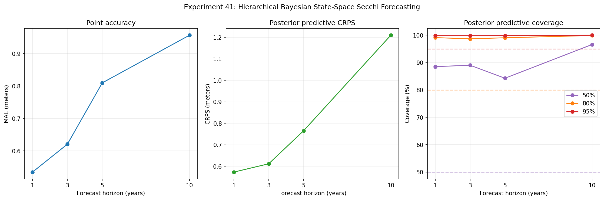
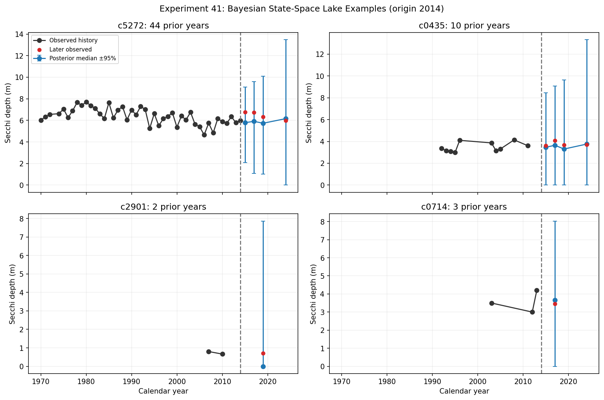

# Experiment 41: Hierarchical Bayesian State-Space Secchi Forecasting

## Objective

Fit the recommended hierarchical Bayesian state-space model for direct annual summer Secchi forecasting. The model separates latent lake clarity from measurement noise, shares information by region, and produces posterior predictive distributions.

## Method

Use the station-balanced annual summer target from Experiment 39 and refit at each expanding-window origin 2005–2014. The latent process is a local-linear trend with irregular calendar-gap process noise. A PyMC potential evaluates the integrated Kalman-filter likelihood, and posterior predictive samples propagate state and hyperparameter uncertainty to horizons 1, 3, 5, and 10.

## Parameters

Dataset ID: `secchi-merged-2026-06-29-r1`. Horizons: `(1, 3, 5, 10)`.

Hierarchy: global level/slope distributions with region group means and scales. Observation model: Gaussian Secchi-depth measurement error. State model: latent level and slope with positive process variances that scale with calendar gaps.

Inference: PyMC ADVI with up to `3000` optimization steps, `200` posterior draws per origin, seed 42. Diagnostics include ELBO start/end, tail relative change, and an explicit convergence-validity gate; only callback termination before the budget is marked valid, while fits that exhaust the budget remain provisional.

Bottom-hit flags remain attached to evaluated lake-years and are reported for diagnostics; explicit censored likelihood treatment is a subsequent refinement because the annual target currently stores the aggregate value plus its bottom-hit rate.

## Results

### Posterior Predictive Accuracy and Calibration

| horizon | n_forecasts | n_lakes | MAE | RMSE | mean_bias | MASE | pct_lakes_beat_naive | CRPS | coverage_50 | width_50 | coverage_80 | width_80 | coverage_95 | width_95 |
| --- | --- | --- | --- | --- | --- | --- | --- | --- | --- | --- | --- | --- | --- | --- |
| 1.0 | 3398.0 | 495.0 | 0.5344 | 0.737 | -0.2199 | 1.0156 | 47.6768 | 0.573 | 0.8852 | 2.0918 | 0.9912 | 4.3476 | 0.9985 | 7.0261 |
| 3.0 | 3293.0 | 459.0 | 0.6205 | 0.858 | -0.2277 | 1.1742 | 47.4946 | 0.6117 | 0.8904 | 2.5171 | 0.9869 | 4.9195 | 0.9985 | 8.2296 |
| 5.0 | 3208.0 | 447.0 | 0.8096 | 1.0669 | -0.549 | 1.5669 | 19.4631 | 0.7654 | 0.8429 | 3.0966 | 0.9906 | 6.3834 | 0.9988 | 8.7991 |
| 10.0 | 3020.0 | 421.0 | 0.9565 | 1.315 | -0.3035 | 1.7151 | 19.2399 | 1.2097 | 0.9662 | 5.673 | 0.999 | 10.0423 | 1.0 | 13.5288 |

### Lake-Level Examples

### Variational Convergence Diagnostics

| origin_year | n_lakes | n_groups | advi_steps | elbo_start | elbo_end | elbo_tail_relative_change | posterior_draws | convergence_valid |
| --- | --- | --- | --- | --- | --- | --- | --- | --- |
| 2005 | 516 | 3 | 3000 | 9571.35713 | 6064.809113 | 0.121813 | 200 | False |
| 2006 | 486 | 3 | 3000 | 9767.884622 | 6140.932076 | 0.123282 | 200 | False |
| 2007 | 485 | 3 | 3000 | 10083.450798 | 6309.39586 | 0.124119 | 200 | False |
| 2008 | 477 | 3 | 3000 | 10280.963914 | 6377.348083 | 0.127411 | 200 | False |
| 2009 | 483 | 3 | 3000 | 10683.495551 | 6609.619576 | 0.127838 | 200 | False |
| 2010 | 480 | 3 | 3000 | 10955.939316 | 6757.339769 | 0.128488 | 200 | False |
| 2011 | 474 | 3 | 3000 | 11349.430536 | 6970.670324 | 0.129482 | 200 | False |
| 2012 | 480 | 3 | 3000 | 11865.00521 | 7290.659749 | 0.108314 | 200 | False |
| 2013 | 482 | 3 | 3000 | 12311.151958 | 7518.137995 | 0.110024 | 200 | False |
| 2014 | 470 | 3 | 3000 | 12340.886342 | 7478.600164 | 0.132635 | 200 | False |

Posterior predictions are persisted at `reports/41_state_space_predictions.csv` for Experiments 44–45.

## Next Step

Compare this full Bayesian state-space model with the direct multi-horizon CatBoost challenger in Experiment 42 and the nonlinear trend-shape challenger in Experiment 43.
