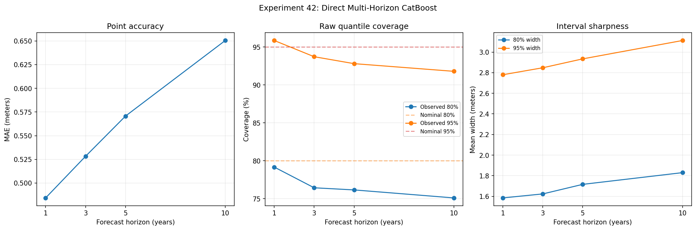

# Experiment 42: Direct Multi-Horizon CatBoost Forecasting

## Objective

Test the main global challenger to the hierarchical state-space model: direct multi-horizon CatBoost trained from lagged annual Secchi history, recent trend features, monitoring support, and static lake characteristics.

## Method

Use the station-balanced annual summer target from Experiment 39 and expanding-window origins 2005–2014. Fit one global CatBoost quantile model per horizon and quantile using only historical training examples whose labels are available by the current origin. Keep q50 point forecasts fixed and expand any crossing quantile bounds outward into nested q10–q90 and q025–q975 intervals before scoring exact future lake-years.

## Parameters

Dataset ID: `secchi-merged-2026-06-29-r1`.

Horizons: `(1, 3, 5, 10)`. Quantiles: `(0.025, 0.1, 0.5, 0.9, 0.975)`.

Features: latest Secchi value, two lagged values, recent five-year mean and slope, full-history slope, history mean/variability, history length/span, gap since last observation, bottom-hit and monitoring-support fields, latitude/longitude, area, depth, elevation, and region. Trophic classification is excluded because its source is not temporally versioned.

CatBoost settings: 100 iterations, depth 5, learning rate 0.05, L2 regularization 7, seed 42. To keep the rolling-origin quantile suite reproducible on the project runtime, each fit uses the latest `8000` eligible historical examples when more are available.

Runtime note: CatBoost is available in the repository runtime. Models are fit separately by horizon and quantile, then Experiment 44 calibrates their raw intervals using rolling-origin residuals.

## Results

### Accuracy and Quantile Calibration

| horizon | n_forecasts | n_lakes | MAE | RMSE | mean_bias | MASE | pct_lakes_beat_naive | coverage_80 | width_80 | interval_score_80 | coverage_95 | width_95 | interval_score_95 | pinball_q10 | pinball_q50 | pinball_q90 |
| --- | --- | --- | --- | --- | --- | --- | --- | --- | --- | --- | --- | --- | --- | --- | --- | --- |
| 1.0 | 3398.0 | 495.0 | 0.4843 | 0.6596 | -0.0402 | 0.93 | 66.6667 | 0.7916 | 1.5849 | 2.2756 | 0.9585 | 2.7802 | 3.4474 | 0.1142 | 0.2422 | 0.1134 |
| 3.0 | 3293.0 | 459.0 | 0.5283 | 0.7265 | -0.1529 | 1.028 | 69.4989 | 0.7643 | 1.6237 | 2.5495 | 0.9371 | 2.8478 | 3.8836 | 0.1227 | 0.2641 | 0.1322 |
| 5.0 | 3208.0 | 447.0 | 0.5707 | 0.7894 | -0.1985 | 1.0928 | 66.6667 | 0.7615 | 1.7164 | 2.7355 | 0.928 | 2.9341 | 4.2129 | 0.1388 | 0.2853 | 0.1347 |
| 10.0 | 3020.0 | 421.0 | 0.6504 | 0.9271 | -0.2116 | 1.2072 | 67.696 | 0.751 | 1.8301 | 3.0691 | 0.9179 | 3.1123 | 5.0682 | 0.1544 | 0.3252 | 0.1525 |

### Fit Sizes

| origin_year | horizon | n_train | n_evaluation |
| --- | --- | --- | --- |
| 2005 | 1 | 6642 | 342 |
| 2005 | 3 | 5798 | 321 |
| 2005 | 5 | 5196 | 323 |
| 2005 | 10 | 3782 | 304 |
| 2006 | 1 | 6984 | 330 |
| 2006 | 3 | 6116 | 333 |
| 2006 | 5 | 5495 | 308 |
| 2006 | 10 | 4039 | 309 |
| 2007 | 1 | 7314 | 329 |
| 2007 | 3 | 6432 | 328 |
| 2007 | 5 | 5794 | 305 |
| 2007 | 10 | 4304 | 301 |
| 2008 | 1 | 7643 | 338 |
| 2008 | 3 | 6753 | 315 |
| 2008 | 5 | 6096 | 311 |
| 2008 | 10 | 4583 | 318 |
| 2009 | 1 | 7981 | 353 |
| 2009 | 3 | 7086 | 325 |
| 2009 | 5 | 6417 | 311 |
| 2009 | 10 | 4875 | 314 |
| 2010 | 1 | 8000 | 340 |
| 2010 | 3 | 7414 | 329 |
| 2010 | 5 | 6740 | 326 |
| 2010 | 10 | 5175 | 291 |
| 2011 | 1 | 8000 | 341 |
| 2011 | 3 | 7729 | 323 |
| 2011 | 5 | 7048 | 345 |
| 2011 | 10 | 5459 | 300 |
| 2012 | 1 | 8000 | 345 |
| 2012 | 3 | 8000 | 338 |
| 2012 | 5 | 7353 | 323 |
| 2012 | 10 | 5742 | 308 |
| 2013 | 1 | 8000 | 331 |
| 2013 | 3 | 8000 | 355 |
| 2013 | 5 | 7664 | 336 |
| 2013 | 10 | 6041 | 286 |
| 2014 | 1 | 8000 | 349 |
| 2014 | 3 | 8000 | 326 |
| 2014 | 5 | 7975 | 320 |
| 2014 | 10 | 6328 | 289 |

Predictions are persisted at `reports/42_catboost_predictions.csv` for Experiments 44–45.

## Next Step

Compare this global direct model with a nonlinear trend-shape challenger in Experiment 43, then calibrate its quantile intervals by horizon and support tier in Experiment 44.
