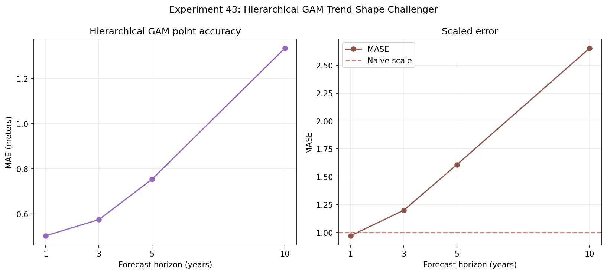

# Experiment 43: Hierarchical GAM Trend-Shape Challenger

## Objective

Test whether a hierarchical GAM trend shape improves direct Secchi forecasting beyond persistence, recent means, the Bayesian state-space model, and the global CatBoost challenger.

## Method

Use the same station-balanced annual summer target and expanding-window origins 2005–2014. For each horizon and origin, fit a PyGAM LinearGAM with shared nonlinear smooths, region and lake factor effects, and neutral zero contribution for unseen factor levels, using only examples available by the origin. Forecasts are evaluated against exact future lake-years.

## Parameters

Dataset ID: `secchi-merged-2026-06-29-r1`. Horizons: `(1, 3, 5, 10)`.

Smooth terms: origin year, latest value, recent mean, recent slope, history length, and monitoring gap. Linear support terms: lagged values, long-run slope, variability, station/readings support, geography, and morphometry. Factor terms: region and MIDAS lake effect; trophic classification is excluded because its source is not temporally versioned. Unseen region/lake levels are encoded for PyGAM compatibility, then their factor partial dependence is removed so they receive a neutral factor contribution. A tensor interaction links latest value and recent slope.

PyGAM settings: six cubic splines per smooth term, max 200 iterations, tolerance 0.01; latest `8000` eligible historical examples per rolling fit when necessary. This is a hierarchical GAM-style factor-pooling challenger; PyGAM does not expose a full Bayesian GAMM random-effect posterior.

## Results

### Accuracy by Horizon

| horizon | n_forecasts | n_lakes | MAE | RMSE | mean_bias | MASE | pct_lakes_beat_naive |
| --- | --- | --- | --- | --- | --- | --- | --- |
| 1.0 | 3398.0 | 495.0 | 0.5044 | 0.6871 | -0.0895 | 0.9709 | 57.9798 |
| 3.0 | 3293.0 | 459.0 | 0.576 | 0.7633 | -0.2811 | 1.199 | 53.3769 |
| 5.0 | 3208.0 | 447.0 | 0.7549 | 0.9598 | -0.5135 | 1.6084 | 36.0179 |
| 10.0 | 3020.0 | 421.0 | 1.3342 | 1.6876 | -0.9782 | 2.6534 | 9.9762 |

### Fit Diagnostics

| origin_year | horizon | n_train | n_evaluation | gcv | edof |
| --- | --- | --- | --- | --- | --- |
| 2005.0 | 1.0 | 6642.0 | 342.0 | 0.551 | 511.0705 |
| 2005.0 | 3.0 | 5798.0 | 321.0 | 0.6129 | 451.1586 |
| 2005.0 | 5.0 | 5196.0 | 323.0 | 0.6243 | 424.5407 |
| 2005.0 | 10.0 | 3782.0 | 304.0 | 0.5847 | 356.1658 |
| 2006.0 | 1.0 | 6984.0 | 330.0 | 0.5407 | 524.038 |
| 2006.0 | 3.0 | 6116.0 | 333.0 | 0.6059 | 463.9778 |
| 2006.0 | 5.0 | 5495.0 | 308.0 | 0.614 | 434.0045 |
| 2006.0 | 10.0 | 4039.0 | 309.0 | 0.5746 | 366.5548 |
| 2007.0 | 1.0 | 7314.0 | 329.0 | 0.5406 | 531.8186 |
| 2007.0 | 3.0 | 6432.0 | 328.0 | 0.6036 | 474.7884 |
| 2007.0 | 5.0 | 5794.0 | 305.0 | 0.6081 | 442.4404 |
| 2007.0 | 10.0 | 4304.0 | 301.0 | 0.569 | 376.1727 |
| 2008.0 | 1.0 | 7643.0 | 338.0 | 0.5288 | 535.9274 |
| 2008.0 | 3.0 | 6753.0 | 315.0 | 0.594 | 485.2456 |
| 2008.0 | 5.0 | 6096.0 | 311.0 | 0.6011 | 451.9469 |
| 2008.0 | 10.0 | 4583.0 | 318.0 | 0.5606 | 388.7708 |
| 2009.0 | 1.0 | 7981.0 | 353.0 | 0.523 | 541.4398 |
| 2009.0 | 3.0 | 7086.0 | 325.0 | 0.586 | 493.5237 |
| 2009.0 | 5.0 | 6417.0 | 311.0 | 0.596 | 463.8337 |
| 2009.0 | 10.0 | 4875.0 | 314.0 | 0.5554 | 396.7049 |
| 2010.0 | 1.0 | 8000.0 | 340.0 | 0.5185 | 550.2574 |
| 2010.0 | 3.0 | 7414.0 | 329.0 | 0.5814 | 499.5706 |
| 2010.0 | 5.0 | 6740.0 | 326.0 | 0.5928 | 471.9663 |
| 2010.0 | 10.0 | 5175.0 | 291.0 | 0.5554 | 403.7738 |
| 2011.0 | 1.0 | 8000.0 | 341.0 | 0.5056 | 554.9045 |
| 2011.0 | 3.0 | 7729.0 | 323.0 | 0.5697 | 506.2245 |
| 2011.0 | 5.0 | 7048.0 | 345.0 | 0.5819 | 479.5389 |
| 2011.0 | 10.0 | 5459.0 | 300.0 | 0.5472 | 411.33 |
| 2012.0 | 1.0 | 8000.0 | 345.0 | 0.4994 | 560.9868 |
| 2012.0 | 3.0 | 8000.0 | 338.0 | 0.5601 | 516.8202 |
| 2012.0 | 5.0 | 7353.0 | 323.0 | 0.5734 | 483.6325 |
| 2012.0 | 10.0 | 5742.0 | 308.0 | 0.544 | 417.1561 |
| 2013.0 | 1.0 | 8000.0 | 331.0 | 0.4788 | 560.7058 |
| 2013.0 | 3.0 | 8000.0 | 355.0 | 0.5448 | 520.4414 |
| 2013.0 | 5.0 | 7664.0 | 336.0 | 0.5656 | 487.9187 |
| 2013.0 | 10.0 | 6041.0 | 286.0 | 0.5382 | 423.0586 |
| 2014.0 | 1.0 | 8000.0 | 349.0 | 0.4553 | 560.9536 |
| 2014.0 | 3.0 | 8000.0 | 326.0 | 0.529 | 522.4277 |
| 2014.0 | 5.0 | 7975.0 | 320.0 | 0.5572 | 498.8001 |
| 2014.0 | 10.0 | 6328.0 | 289.0 | 0.5292 | 428.9164 |

Predictions are persisted at `reports/43_spline_predictions.csv` for Experiment 45.

## Next Step

Use the rolling-origin residuals from the direct CatBoost challenger to calibrate prediction intervals and define support tiers in Experiment 44. The GAM challenger remains a candidate only if its nonlinear shape improves long-horizon error without unstable extrapolation.
