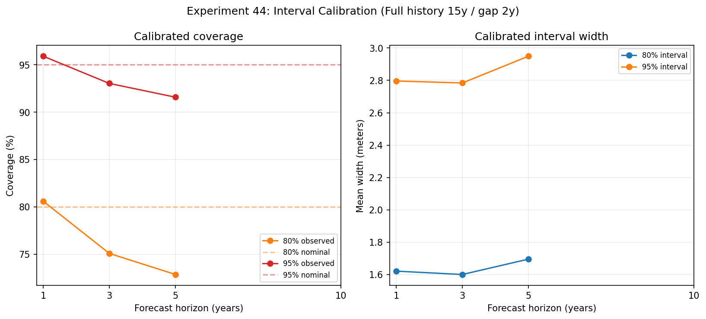

# Experiment 44: Interval Calibration and Support Policy

## Objective

Calibrate direct CatBoost prediction intervals using only earlier rolling-origin residuals and select a reproducible forecast-support policy. The policy separates full, limited, and unavailable forecasts rather than presenting equal confidence for every lake.

## Method

Read Experiment 42’s horizon-specific CatBoost quantile predictions. For each origin, horizon, and candidate support policy, compute a conformal-style nonnegative adjustment from residual scores at earlier origins whose outcomes are already observed, then expand the raw q10–q90 and q025–q975 intervals. Rank six history/recency policies on available calibrated coverage error plus a small width penalty.

## Parameters

Dataset ID: `secchi-merged-2026-06-29-r1`.

Candidate full-history thresholds: 5, 10, or 15 observed summer years. Candidate full-recency thresholds: 2 or 5 years. Limited support requires at least 2 observed years and a gap of at most 5 years.

Conformal scores are horizon-specific and use only earlier origins, avoiding calibration leakage. Intervals are prediction intervals, not confidence intervals. Coverage is empirical over pooled, serially correlated rolling-origin residuals; it is not a formal guarantee. A residual is eligible only when its forecast year is no later than the current origin, so the 10-year backtest has no outcome-matured calibration residuals. Finite-sample conservative quantiles are used, and the 95% adjustment is constrained to be at least the 80% adjustment so intervals remain nested.

## Results

### Selected Support Policy

**Full history 15y / gap 2y**. Selection score: **0.0578**.

### Candidate Policies

| policy | selection_score | full_lakes | limited_lakes | unavailable_lakes | coverage_80_h5_h10 | coverage_95_h5_h10 |
| --- | --- | --- | --- | --- | --- | --- |
| Full history 15y / gap 2y | 0.0578 | 330 | 170 | 584 | 0.7285 | 0.9158 |
| Full history 15y / gap 5y | 0.0594 | 353 | 147 | 584 | 0.7285 | 0.9158 |
| Full history 10y / gap 2y | 0.0617 | 352 | 148 | 584 | 0.7285 | 0.9158 |
| Full history 10y / gap 5y | 0.0655 | 382 | 118 | 584 | 0.7285 | 0.9158 |
| Full history 5y / gap 2y | 0.0659 | 388 | 112 | 584 | 0.7285 | 0.9158 |
| Full history 5y / gap 5y | 0.0747 | 440 | 60 | 584 | 0.7285 | 0.9158 |

### Calibrated Coverage and Sharpness

| horizon | n_80 | coverage_80 | width_80 | interval_score_80 | n_95 | coverage_95 | width_95 | interval_score_95 |
| --- | --- | --- | --- | --- | --- | --- | --- | --- |
| 1.0 | 3056.0 | 0.806 | 1.6214 | 2.2781 | 3056.0 | 0.9591 | 2.7962 | 3.4742 |
| 3.0 | 2311.0 | 0.7508 | 1.6005 | 2.6241 | 2311.0 | 0.9303 | 2.784 | 3.9729 |
| 5.0 | 1650.0 | 0.7285 | 1.6956 | 2.9569 | 1650.0 | 0.9158 | 2.9495 | 4.491 |
| 10.0 |  |  |  |  |  |  |  |  |

Rows without outcome-matured calibration residuals are retained in the prediction artifact with null calibrated intervals and are excluded from calibrated coverage/sharpness summaries. The 5-year/10-year columns in the candidate table contain only the available matured horizon (5 years); no 10-year calibration result exists in this backtest. Candidate-policy ranking is exploratory because support labels are selected from the same rolling-origin backtest; it is not an independent confirmation set.

### Support-Tier Diagnostics at 5 and 10 Years

| horizon | support_tier | n_80 | coverage_80 | width_80 | interval_score_80 | n_95 | coverage_95 | width_95 | interval_score_95 |
| --- | --- | --- | --- | --- | --- | --- | --- | --- | --- |
| 5 | Full | 1224.0 | 0.7312 | 1.6886 | 2.9726 | 1224.0 | 0.9199 | 2.9271 | 4.4826 |
| 5 | Limited | 426.0 | 0.7207 | 1.7155 | 2.9119 | 426.0 | 0.9038 | 3.0141 | 4.5152 |
| 10 | Full |  |  |  |  |  |  |  |  |
| 10 | Limited |  |  |  |  |  |  |  |  |

### Group Diagnostics at 5 and 10 Years

| group | level | horizon | n_forecasts | MAE | n_interval_80 | coverage_80 | n_interval_95 | coverage_95 |
| --- | --- | --- | --- | --- | --- | --- | --- | --- |
| REGION | Coastal | 5 | 2341 | 0.5501 | 1210 | 0.7198 | 1210 | 0.919 |
| REGION | Inland | 5 | 786 | 0.6231 | 405 | 0.758 | 405 | 0.916 |
| REGION | Northern | 5 | 81 | 0.656 | 35 | 0.6857 | 35 | 0.8 |
| REGION | Coastal | 10 | 2236 | 0.6237 | 0 |  | 0 |  |
| REGION | Inland | 10 | 700 | 0.7298 | 0 |  | 0 |  |
| REGION | Northern | 10 | 84 | 0.7015 | 0 |  | 0 |  |
| Bottom-hit rate >= 0.5 | No | 5 | 2985 | 0.5863 | 1516 | 0.719 | 1516 | 0.9123 |
| Bottom-hit rate >= 0.5 | Yes | 5 | 223 | 0.3618 | 134 | 0.8358 | 134 | 0.9552 |
| Bottom-hit rate >= 0.5 | No | 10 | 2798 | 0.6539 | 0 |  | 0 |  |
| Bottom-hit rate >= 0.5 | Yes | 10 | 222 | 0.6074 | 0 |  | 0 |  |

### Final-Latest-Year Support Counts

| support_tier | n_lakes | median_history_years | median_gap |
| --- | --- | --- | --- |
| Full | 330 | 36.0 | 0.0 |
| Limited | 170 | 7.0 | 2.0 |
| Unavailable | 584 | 2.0 | 21.0 |

Calibrated predictions are persisted at `reports/44_calibrated_predictions.csv` for Experiment 45.

## Next Step

Use the calibrated metrics, support counts, and long-horizon decision gates to select the final candidate in Experiment 45. Treat policy ranking as exploratory because candidate support labels are tuned on the same rolling-origin backtest rows; long-horizon rows without outcome-matured residuals are withheld from calibration metrics.
