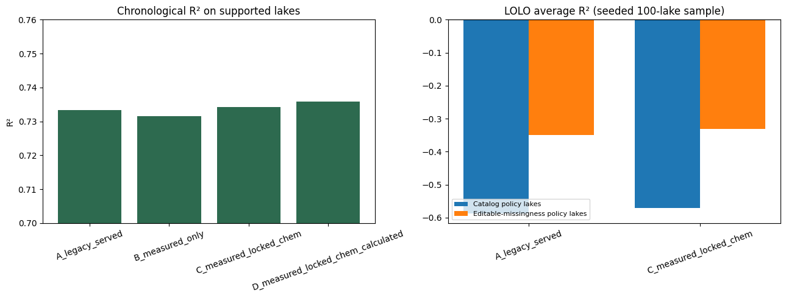

# Experiment 47: Playground Feature Contract on the June Dataset

## Objective

Select the playground feature contract for the active June dataset. In this snapshot PH, COLOR, CONDUCT, and ALK are fixed lake-level means rather than per-visit measurements, so they can no longer be user-editable, while the provider added TMAX and TMIN as directly measured profile fields. The experiment tests whether a contract with only directly measured editable inputs (dissolved oxygen, temperature, phosphorus) plus locked lake chemistry matches the accuracy of the currently served 14-feature model and of a wider set that adds the calculated profile metrics.

## Method

Tuned native-missing CatBoost from Experiments 34 and 38 is refit unchanged for each feature set. Chronological evaluation uses an 80/20 date-ordered split on lakes that satisfy the Experiment 38 support policy (n_obs >= 100 and cataloged chemistry missingness <= 0.90). Leave-one-lake-out evaluation reuses the seeded 10-lake and 100-lake lists carried over from the 2025 snapshot so results are comparable with Experiments 35 and 38, restricted to lakes that satisfy the same policy. The 10-lake set screens the served, measured-only, and measured-plus-locked-chemistry sets; the 100-lake set confirms the served set against the measured-plus-locked-chemistry candidate only. The calculated-profile set is evaluated chronologically only because those fields have no provider definitions yet. Lake support is also recomputed using missingness over the six measured slider fields to check whether the cataloged threshold still discriminates on this snapshot.

## Parameters

Dataset ID: `secchi-merged-2026-06-29-r1`.

CatBoost parameters: {'iterations': 700, 'depth': 10, 'learning_rate': 0.05, 'l2_leaf_reg': 3, 'random_seed': 42, 'loss_function': 'RMSE', 'eval_metric': 'RMSE', 'verbose': False, 'allow_writing_files': False, 'thread_count': -1}

- `A_legacy_served` (14 features): ['year', 'month', 'LATITUDE', 'LONGITUDE', 'AREA_ACRES', 'DEPTH_MAX_FEET', 'DOMAX', 'DOMIN', 'TPEC', 'TPBG', 'PH', 'COLOR', 'CONDUCT', 'ALK']
- `B_measured_only` (12 features): ['year', 'month', 'LATITUDE', 'LONGITUDE', 'AREA_ACRES', 'DEPTH_MAX_FEET', 'DOMAX', 'DOMIN', 'TMAX', 'TMIN', 'TPEC', 'TPBG']
- `C_measured_locked_chem` (16 features): ['year', 'month', 'LATITUDE', 'LONGITUDE', 'AREA_ACRES', 'DEPTH_MAX_FEET', 'DOMAX', 'DOMIN', 'TMAX', 'TMIN', 'TPEC', 'TPBG', 'PH', 'COLOR', 'CONDUCT', 'ALK']
- `D_measured_locked_chem_calculated` (22 features): ['year', 'month', 'LATITUDE', 'LONGITUDE', 'AREA_ACRES', 'DEPTH_MAX_FEET', 'DOMAX', 'DOMIN', 'TMAX', 'TMIN', 'TPEC', 'TPBG', 'PH', 'COLOR', 'CONDUCT', 'ALK', 'MLD', 'THERMO', 'SCHMIDT', 'OXIC_DEPTH', 'EPI_TEMP', 'HYPO_TEMP']

CHLA is excluded from every set because it is target-adjacent. `MTB` is excluded because it encodes the lake-station identifier, and `DEPTH` because it records the profile depth reached on the sampling date rather than a lake condition.

## Results

### Chronological evaluation on supported lakes

Supported rows: 151,686 across 360 lakes; test window 2017–2024.

| feature_set | n_features | R2 | MAE | RMSE | MAE_Norm | fit_seconds |
| --- | --- | --- | --- | --- | --- | --- |
| A_legacy_served | 14 | 0.733 | 0.793 | 1.083 | 0.018 | 12 |
| B_measured_only | 12 | 0.732 | 0.799 | 1.087 | 0.018 | 10 |
| C_measured_locked_chem | 16 | 0.734 | 0.789 | 1.081 | 0.018 | 11 |
| D_measured_locked_chem_calculated | 22 | 0.736 | 0.786 | 1.078 | 0.018 | 14 |

### Feature importance for `C_measured_locked_chem`

| feature | importance | role |
| --- | --- | --- |
| COLOR | 27.865 | locked |
| DEPTH_MAX_FEET | 13.628 | locked |
| year | 8.485 | locked |
| CONDUCT | 8.062 | locked |
| AREA_ACRES | 8.049 | locked |
| LONGITUDE | 6.94 | locked |
| LATITUDE | 6.306 | locked |
| ALK | 5.787 | locked |
| PH | 5.061 | locked |
| month | 4.46 | locked |
| TPEC | 1.601 | editable |
| DOMAX | 1.025 | editable |
| TMAX | 0.956 | editable |
| DOMIN | 0.845 | editable |
| TMIN | 0.792 | editable |
| TPBG | 0.139 | editable |

### Locked lake chemistry in this snapshot

| field | unique_values_per_lake_max | lakes_with_value |
| --- | --- | --- |
| PH | 1 | 723 |
| COLOR | 1 | 793 |
| CONDUCT | 1 | 782 |
| ALK | 1 | 781 |

### Leave-one-lake-out summary

Retained seeded lakes: 10-lake set 8/10, 100-lake set 63/100. Per-lake results for every feature set are in `47_lolo_per_lake.csv`.

| lake_sample | restriction | feature_set | n_lakes | avg_R2 | median_R2 | avg_MAE |
| --- | --- | --- | --- | --- | --- | --- |
| Seeded 10-lake set | Catalog policy lakes | A_legacy_served | 8 | -0.451 | 0.014 | 1.093 |
| Seeded 10-lake set | Catalog policy lakes | B_measured_only | 8 | -2.925 | -0.627 | 1.4 |
| Seeded 10-lake set | Catalog policy lakes | C_measured_locked_chem | 8 | -0.427 | 0.039 | 1.049 |
| Seeded 10-lake set | Editable-missingness policy lakes | A_legacy_served | 6 | 0.138 | 0.07 | 0.745 |
| Seeded 10-lake set | Editable-missingness policy lakes | B_measured_only | 6 | -0.339 | -0.034 | 0.939 |
| Seeded 10-lake set | Editable-missingness policy lakes | C_measured_locked_chem | 6 | 0.161 | 0.062 | 0.736 |
| Seeded 100-lake set | Catalog policy lakes | A_legacy_served | 63 | -0.587 | -0.186 | 0.922 |
| Seeded 100-lake set | Catalog policy lakes | C_measured_locked_chem | 63 | -0.571 | -0.169 | 0.929 |
| Seeded 100-lake set | Editable-missingness policy lakes | A_legacy_served | 37 | -0.35 | -0.035 | 0.891 |
| Seeded 100-lake set | Editable-missingness policy lakes | C_measured_locked_chem | 37 | -0.33 | -0.112 | 0.9 |

### Support policy coverage

| policy | rule | lakes | rows |
| --- | --- | --- | --- |
| Catalog missingness (22 profile + lake-chemistry fields) | n_obs >= 100 and pct_missing <= 0.90 | 360 | 151686 |
| Measured editable missingness (6 slider fields) | n_obs >= 100 and pct_missing <= 0.90 | 208 | 102996 |
| n_obs >= 100 only | n_obs >= 100 | 361 | 152112 |

## Next Step

Serve the measured-plus-locked-chemistry contract. Keep n_obs >= 100 as the selectability rule. Flag supported lakes with sparse measured slider fields as thin_history rather than dropping them. Do not treat the Experiment 38 chemistry-missingness cutoff as an active June filter.
